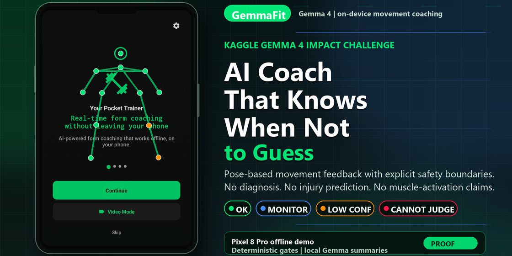
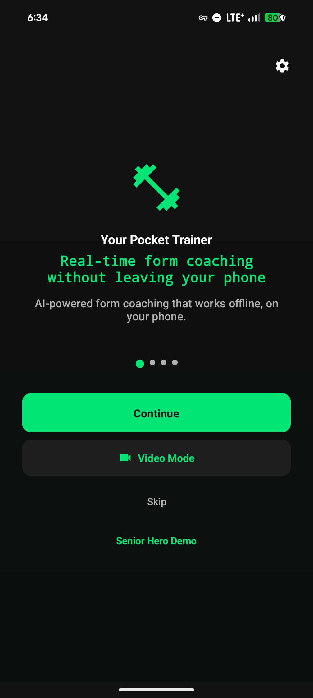
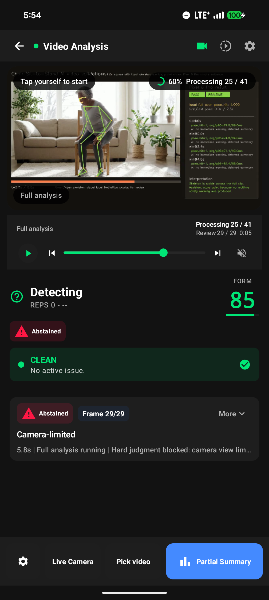
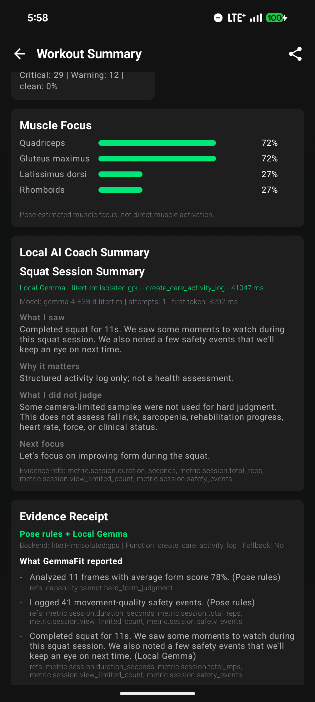
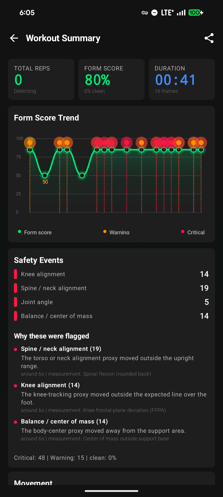
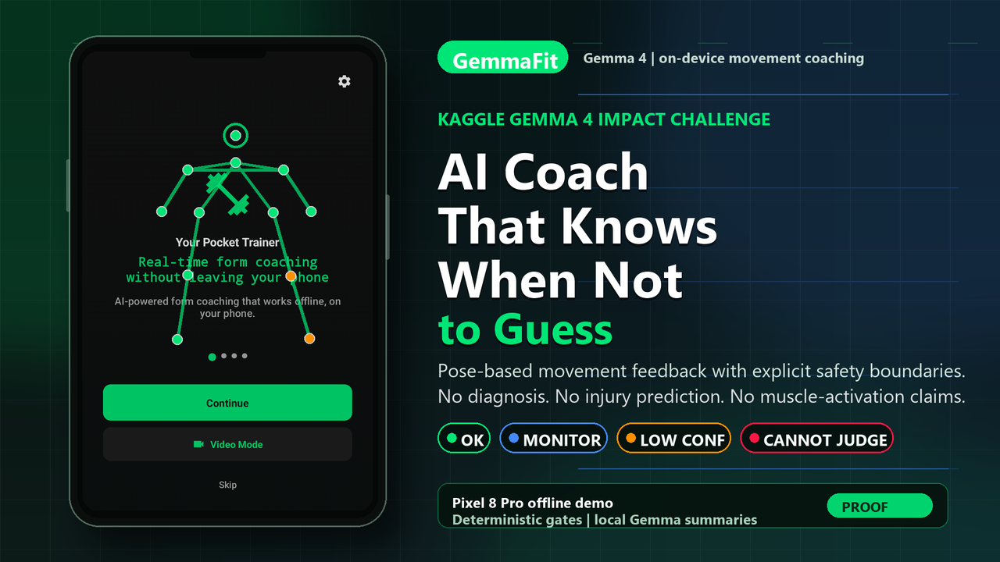
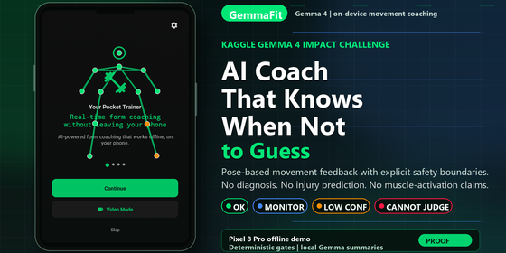

# GemmaFit

<p align="center">
  
</p>

GemmaFit is a local-first movement coaching app for the Kaggle Gemma 4
Impact Challenge. It runs on Android and combines single-camera pose evidence,
deterministic safety gates, MotionZip evidence compression, and local Gemma
summaries.

The product goal is simple:

```text
Trustworthy motion feedback that knows its limits.
```

GemmaFit does not try to be a medical device. It gives movement-quality
feedback, explains what it could and could not judge, and refuses unsupported
health, force, fall-risk, EMG, or diagnosis claims.

## Current Mainline

As of 2026-05-17, `main` is the demo-ready Android mainline:

- Pixel-focused Android app written in Kotlin and Jetpack Compose.
- MediaPipe Pose based live and video movement analysis.
- Senior Strength Mode as the hero demo flow.
- Deterministic live safety path with no per-frame LLM calls.
- MotionZip compact temporal evidence packets for session summaries.
- Official `Gemma-4-E2B-it` LiteRT-LM as the P0 local summary backend.
- Android-owned JSON cleanup, schema validation, evidence-ref checks,
  deterministic fill, and fallback.
- Review UI with frame-level cues and summary-linked moments.

## Demo APK And Model Requirement

A debug-signed demo APK has been exported for local Pixel testing:

| Item | Value |
| --- | --- |
| APK | `releases/GemmaFit-demo-debug-v1.0.0-20260517-182618.apk` |
| Package | `com.gemmafit` |
| Variant | Debug-signed demo build |
| Size | `173,820,675` bytes |
| SHA-256 | `6BB2098CD3BB77E883ECB259532567F7A47DDD2874765A7706CB0BBDC61B6298` |

APK binaries are intentionally ignored by Git. The path above is the latest
local artifact from this workspace; rebuild it with `.\gradlew.bat :app:assembleDebug`
when cloning fresh.

Install it with:

```powershell
adb install -r releases\GemmaFit-demo-debug-v1.0.0-20260517-182618.apk
```

Local Gemma inference still requires the phone to already have the LiteRT-LM
model file. The APK does not bundle the multi-GB model artifact.

Expected device-side model path for the P0 official E2B backend:

```text
/sdcard/Android/data/com.gemmafit/files/gemma-4-E2B-it.litertlm
```

Example push command:

```powershell
adb push path\to\gemma-4-E2B-it.litertlm /sdcard/Android/data/com.gemmafit/files/gemma-4-E2B-it.litertlm
```

Without the `.litertlm` file, deterministic pose analysis, MotionZip evidence,
review cues, and fallback summaries can still run. The Local Gemma session
summary and evidence wording require the model to be present on device.

## Demo Screenshots

These are real Pixel captures from the current demo path and benchmarked review
flow. They show the product-facing claim: on-device movement evidence first,
bounded local Gemma wording second, with explicit safety and evidence limits.

| Offline entry | Video analysis with abstention | Local Gemma summary |
| --- | --- | --- |
|  |  |  |

| Evidence explanation |
| --- |
|  |

## Media Gallery Assets

The repository includes submission-ready product images for the Kaggle media
gallery and public demo video thumbnail. They intentionally use movement-quality
and safety-boundary language only.

| Asset | Use | File |
| --- | --- | --- |
|  | Kaggle report cover / media gallery | `docs/assets/media_gallery/gemmafit_cover_1120x560.png` |
|  | YouTube demo thumbnail | `docs/assets/media_gallery/gemmafit_thumbnail_new_1280x720.png` |
|  | Minimum 560 x 280 fallback cover | `docs/assets/media_gallery/gemmafit_cover_560x280.png` |

## Architecture

```text
CameraX / Video
-> MediaPipe Pose
-> pose presence, subject, confidence, and judgeability gates
-> derived motion features
-> Senior Layer 2 temporal interpreter
-> ActivityContextTracker
-> MotionZip compact evidence
-> ModelInvocationScheduler
-> local Gemma summary or deterministic fallback
-> UI, TTS, review cues, care log, export
```

The key design split is ownership:

| Layer | Responsibility |
| --- | --- |
| MediaPipe and gates | Person visibility, selected subject, confidence, renderability |
| Motion tools | Angles, tempo, ROM proxies, stability proxies, event windows |
| Senior Layer 2 | Activity phase, event, judgeability, abstain reason |
| MotionZip | Compress temporal evidence for low-token local summaries |
| Scheduler | Decide whether a model call is allowed now, deferred, or skipped |
| Local Gemma | Produce bounded session wording from listed evidence |
| Validator | Enforce JSON shape, evidence refs, forbidden claims, and fallback |

Live coaching stays deterministic. Gemma is used for low-frequency explanation,
summary, and export wording after evidence is already computed.

## What GemmaFit Can Say

GemmaFit can say:

- movement quality feedback,
- pose-based estimate,
- single-camera proxy,
- camera-limited observation,
- training cue,
- unsupported judgment boundary.

GemmaFit must not say:

- medical diagnosis,
- injury prediction,
- fall-risk score,
- sarcopenia detection,
- rehabilitation prescription,
- precise joint force,
- GRF,
- EMG or true muscle activation.

## Evidence And Benchmarks

Current benchmark evidence is indexed in
[`docs/benchmark/README.md`](docs/benchmark/README.md).

Headline proof points:

| Claim | Evidence |
| --- | --- |
| Official E2B can produce parseable bounded JSON | `docs/benchmark/litert_prompt_smoke_constrained_100_official_2026-05-16/summary.json` |
| Warm streaming improves perceived latency after prewarm | `docs/benchmark/litert_prompt_stream_dev_2_warm_official_2026-05-16/summary.json` |
| MotionZip preserves key session facts for tested prompts | `docs/benchmark/motionzip_equivalence_prompt_endpoint_hardened4_official_2026-05-16/summary.json` |
| Live safety remains deterministic | `docs/benchmark/live_safety_contract_report_2026-05-16/report.md` |
| Vision sidecar is not in the P0 phone flow | `docs/benchmark/gemma4_vision_mmproj_q8_vs_f16/README.md` |

These artifacts support demo and engineering claims. They do not validate
clinical biomechanics thresholds or medical outcomes.

## Repository Map

```text
app/                 Android Kotlin app
native/              Native biomechanics experiments and tests
prototype/           Python validation and report-generation scripts
finetune/            Fine-tuning notebooks, generators, and metrics
docs/design/         Architecture and implementation specs
docs/benchmark/      Device, model, UI, and MotionZip evidence
docs/papers/         Literature review and claim-support notes
docs/scripts/        Demo and submission narration scripts
```

Start here:

- [`implementation_plan.md`](implementation_plan.md) is the product and
  architecture source of truth.
- [`docs/README.md`](docs/README.md) is the documentation index.
- [`docs/design/project_architecture_and_technical_highlights.md`](docs/design/project_architecture_and_technical_highlights.md)
  summarizes the current stack.
- [`docs/design/official_e2b_motionzip_runtime_architecture.md`](docs/design/official_e2b_motionzip_runtime_architecture.md)
  details the official E2B + MotionZip runtime.
- [`docs/design/layer2_senior_activity_model.md`](docs/design/layer2_senior_activity_model.md)
  describes the senior activity interpreter.

## Build

Windows PowerShell:

```powershell
$env:JAVA_HOME = 'C:\Users\ken\.jdks\openjdk-23.0.2'
.\gradlew.bat :app:compileDebugKotlin
.\gradlew.bat :app:assembleDebug
```

Install a debug APK on a connected Android device:

```powershell
adb install -r app\build\outputs\apk\debug\app-debug.apk
```

## Local Model Notes

Model binaries are intentionally not committed. Place local model artifacts
under `models/` for desktop experiments or the app-specific Android external
files directory for phone inference. For the demo APK, Local Gemma requires:

```text
/sdcard/Android/data/com.gemmafit/files/gemma-4-E2B-it.litertlm
```

The current P0 path uses the official Google AI Edge / LiteRT-LM
`Gemma-4-E2B-it` artifact for local session summaries. GemmaFit v5 fine-tuning
and multimodal vision sidecars remain optional research or quality layers, not
requirements for the demo mainline.

## Safety Policy

GemmaFit uses abstention as a feature:

- If the camera view is limited, it says so.
- If pose confidence is too low, it holds judgment.
- If an activity context is ambiguous, it avoids forcing a label.
- If a model output cites missing evidence or makes forbidden claims, Android
  rejects it and uses deterministic fallback.

That boundary is the core trust mechanism of the project.
