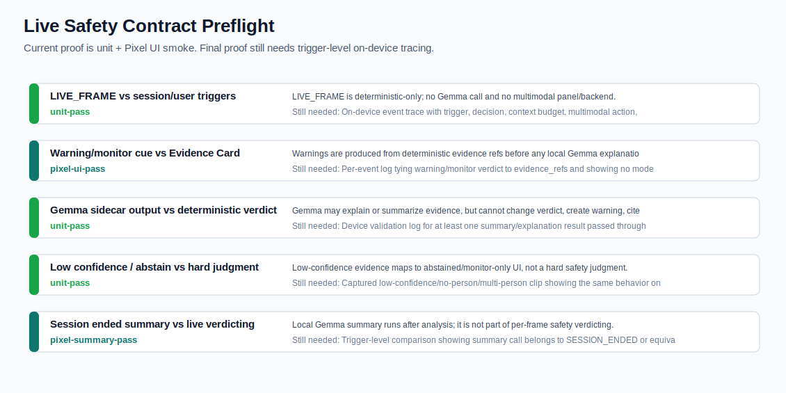

# Live Safety Contract Preflight Report

Date: 2026-05-16

## Conclusion

This preflight supports the video narrative but is not the final on-device live contract proof. The targeted tests passed and the Pixel smoke already shows deterministic analysis, Why flagged explanations, and Local Gemma summary. The missing final artifact is a trigger-level device trace proving `LIVE_FRAME` has zero model/multimodal backend calls while `SESSION_ENDED` or user-triggered flows may call Local Gemma after deterministic evidence exists.



## Targeted Test Run

Command:

```powershell
$env:JAVA_HOME='D:\gradle-cache\jdk-21-temurin'; $env:PATH="$env:JAVA_HOME\bin;$env:PATH"; .\gradlew.bat :app:testDebugUnitTest --tests com.gemmafit.video.ModelInvocationSchedulerTest --tests com.gemmafit.video.MultimodalResultValidatorTest --tests com.gemmafit.video.TrustUiStateTest --no-daemon
```

Result: `28` targeted tests, `0` failures/errors.

| Test class | Tests | Failures | Errors | Artifact |
| --- | ---: | ---: | ---: | --- |
| `com.gemmafit.video.ModelInvocationSchedulerTest` | 15 | 0 | 0 | `app/build/test-results/testDebugUnitTest/TEST-com.gemmafit.video.ModelInvocationSchedulerTest.xml` |
| `com.gemmafit.video.MultimodalResultValidatorTest` | 5 | 0 | 0 | `app/build/test-results/testDebugUnitTest/TEST-com.gemmafit.video.MultimodalResultValidatorTest.xml` |
| `com.gemmafit.video.TrustUiStateTest` | 8 | 0 | 0 | `app/build/test-results/testDebugUnitTest/TEST-com.gemmafit.video.TrustUiStateTest.xml` |

## Contract Comparison

| Comparison | Expected contract | Current evidence | Status | Still needed |
| --- | --- | --- | --- | --- |
| LIVE_FRAME vs session/user triggers | LIVE_FRAME is deterministic-only; no Gemma call and no multimodal panel/backend. | ModelInvocationSchedulerTest passed 15/15, including live frame deterministic skip and live multimodal backend skip. | `unit-pass` | On-device event trace with trigger, decision, context budget, multimodal action, and backend_call_count=0. |
| Warning/monitor cue vs Evidence Card | Warnings are produced from deterministic evidence refs before any local Gemma explanation. | Pixel smoke shows full analysis PASS and user-facing Why flagged explanations PASS. | `pixel-ui-pass` | Per-event log tying warning/monitor verdict to evidence_refs and showing no model-created warning. |
| Gemma sidecar output vs deterministic verdict | Gemma may explain or summarize evidence, but cannot change verdict, create warning, cite missing refs, or make forbidden claims. | MultimodalResultValidatorTest passed 5/5: missing refs, verdict mutation, new warning, forbidden claims, and low-confidence overconfidence are rejected. | `unit-pass` | Device validation log for at least one summary/explanation result passed through validator. |
| Low confidence / abstain vs hard judgment | Low-confidence evidence maps to abstained/monitor-only UI, not a hard safety judgment. | TrustUiStateTest passed 8/8, including low confidence -> Abstained and pose preview separate from hard judgment. | `unit-pass` | Captured low-confidence/no-person/multi-person clip showing the same behavior on Pixel. |
| Session ended summary vs live verdicting | Local Gemma summary runs after analysis; it is not part of per-frame safety verdicting. | Pixel smoke shows Local Gemma summary PASS, first token under 5s, backend litert-lm:isolated:gpu. | `pixel-summary-pass` | Trigger-level comparison showing summary call belongs to SESSION_ENDED or equivalent, never LIVE_FRAME. |

## Pixel Smoke Anchors

- Full analysis PASS: `True`
- Local Gemma summary PASS: `True`
- First token under 5s PASS: `True`
- Why flagged explanations PASS: `True`
- Deterministic explanation wording present: `True`
- MotionZip blocks zero constraint noted: `True`

Source: `docs/benchmark/pixel_demo_flow_smoke_2026-05-16/README.md`

## Video Use Guidance

- Safe to show now: skeleton/analysis UI, Why flagged deterministic explanations, Local Gemma summary screen.
- Safe to say now: "GemmaFit separates deterministic safety evidence from Local Gemma explanations."
- Do not say yet: "The live frame path has been proven on-device to make zero model calls" until the trigger-level trace report is generated.
- Do not imply Vision/Gemma decides live `WARNING`, `MONITOR`, or `LOW_CONFIDENCE` verdicts.

## Required Final Trace

The final `live_safety_contract_report_2026-05-16` should collect a device event log with at least:

- `timestamp_ms`
- `trigger`
- `deterministic_verdict`
- `evidence_refs`
- `model_decision`
- `multimodal_action`
- `backend_call_count`
- `validator_result`

Acceptance: all `LIVE_FRAME` rows have `backend_call_count = 0`, while post-evidence triggers may call Local Gemma and must pass validator/ref checks.
