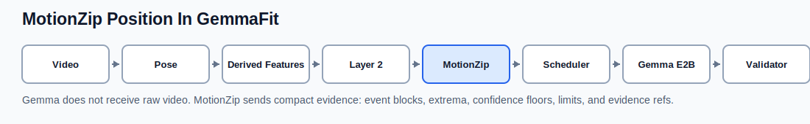
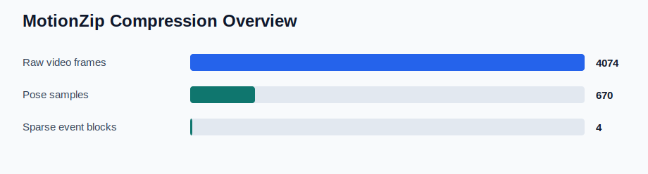
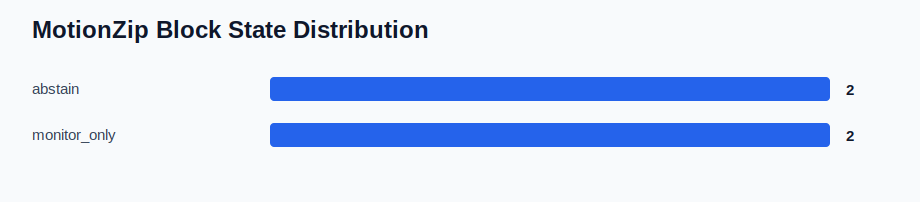
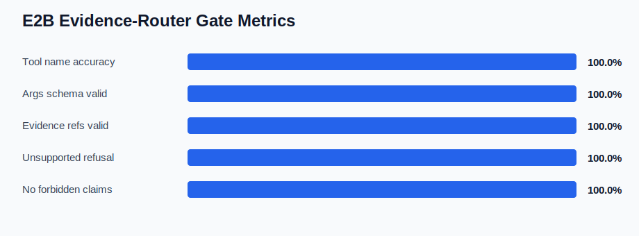

# MotionZip Effectiveness Report

This report verifies MotionZip as temporal evidence compression, not as video codec compression.
It checks that compact packets preserve safety-critical evidence before Gemma sees them.

## Summary

| Metric | Value |
| --- | ---: |
| Fixtures | 2 |
| Sparse event blocks | 4 |
| Required field presence | 100.0% |
| Abstain reason presence | 100.0% |
| Hard-coaching upgrade rate | 0.0% |
| Forbidden payload rate | 0.0% |
| Pose samples per sparse block | 167.5x |
| Video frames per sparse block | 1018.5x |
| E2B tool-name accuracy | 100.0% |
| E2B evidence-ref validity | 100.0% |
| E2B unsupported-refusal rate | 100.0% |
| E2B forbidden-claim rate | 0.0% |

## Visuals

## Fixture Details

| Fixture | Blocks | States | Confidence floors | Pose samples/block | Contract |
| --- | ---: | --- | --- | ---: | --- |
| prototype\data\validation\results\lunge_forward_army_motionzip_motionzip_packet.json | 2 | abstain:1, monitor_only:1 | 0.5145, 0.5682 | 167.5x | PASS |
| prototype\data\validation\results\lunge_forward_army_motionzip_packet.json | 2 | abstain:1, monitor_only:1 | 0.5145, 0.5682 | 167.5x | PASS |

## Boundary

Passing this benchmark supports MotionZip packet integrity, conservative uncertainty handling,
privacy-oriented payload shaping, and E2B evidence-router compatibility. It does not validate
clinical outcomes, fall-risk prediction, sarcopenia detection, rehabilitation progress, force,
GRF, EMG, or muscle activation.
