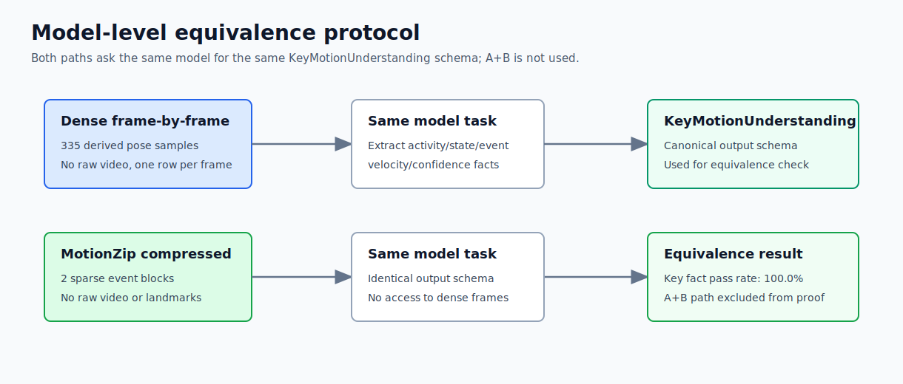
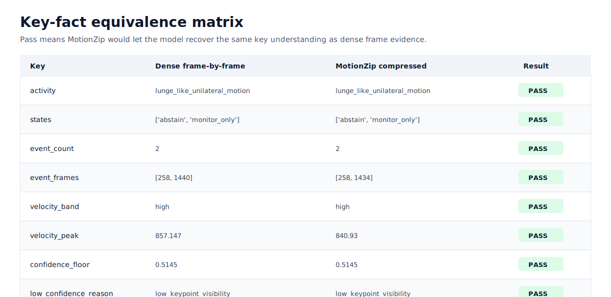

# MotionZip Model Equivalence Benchmark

This benchmark targets the actual claim: a model should recover the same key motion understanding from MotionZip compressed evidence as it would from dense frame-by-frame derived evidence.

## Inputs

| Path | Model input |
| --- | --- |
| `dense_frame_by_frame_prompt.json` | Every derived pose sample as one compact frame evidence row |
| `motionzip_compressed_prompt.json` | Sanitized MotionZip event packet only |
| `model_prompt_pair.jsonl` | Same two prompts in JSONL form for a real model runner |
| `model_prompt_pair_compact.jsonl` | Phone-ready pair: dense event-window frame rows vs MotionZip event blocks |

## Result

### Oracle Equivalence

| Metric | Value |
| --- | ---: |
| Overall pass | True |
| Key fact pass rate | 100.0% |
| Dense frame rows | 335 |
| Dense event-window rows | 18 |
| MotionZip event blocks | 2 |
| Dense prompt size | 111418 bytes |
| MotionZip prompt size | 6632 bytes |
| Compact prompt-pair size | 8768 bytes |

### Pixel LiteRT Model Equivalence

| Metric | Value |
| --- | ---: |
| Overall pass | True |
| Key fact pass rate | 100.0% |
| Backend | `litert-lm:raw:cpu` |
| Prompt pair | `model_prompt_pair_compact.jsonl` |
| Prompt-pair size | 8768 bytes |
| Model elapsed | 142688 ms |

The Pixel run executed the same `.litertlm` model on the dense event-window prompt and the MotionZip prompt. The model outputs matched on activity, states, event count, event frame timing, velocity band, peak velocity, confidence floor, and low-confidence reason. See `pixel_litert_model_equivalence_2026-05-13.md`.

## Visuals





## Key-Fact Checks

| Key | Pass |
| --- | --- |
| `activity` | True |
| `states` | True |
| `event_count` | True |
| `event_frames` | True |
| `velocity_band` | True |
| `velocity_peak` | True |
| `confidence_floor` | True |
| `low_confidence_reason` | True |

## How To Reproduce On Pixel

Run the same local model on both prompts and require the model to return `KeyMotionUnderstanding`.
Then compare the two model outputs with the same key checks used here. The debug provider exposes the phone runner as:

```bash
adb push docs/benchmark/motionzip_model_equivalence/model_prompt_pair_compact.jsonl /sdcard/Android/data/com.gemmafit/files/model_prompt_pair_compact.jsonl
adb shell content read --uri 'content://com.gemmafit.debug/motionzip_model_equivalence?file=model_prompt_pair_compact.jsonl'
```

- Dense prompt: `dense_frame_by_frame_prompt.json`
- MotionZip prompt: `motionzip_compressed_prompt.json`
- Prompt pair JSONL: `model_prompt_pair.jsonl`
- Phone-ready compact prompt pair: `model_prompt_pair_compact.jsonl`

The full dense prompt is kept for offline inspection, but the Pixel run uses the compact phone-ready prompt pair because the full 111 KB dense prompt is too large for the current on-device context budget.
