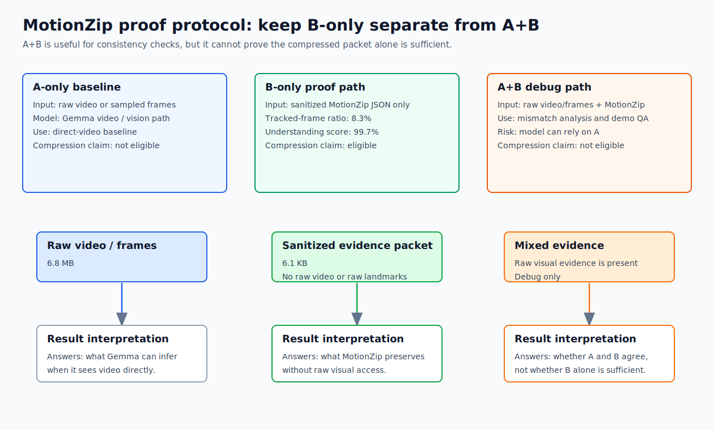
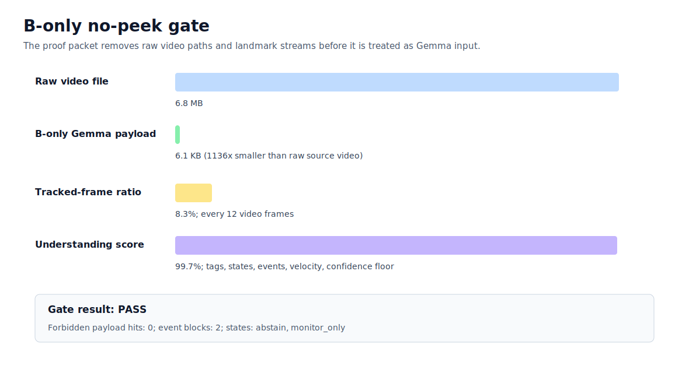

# MotionZip B-only Proof Protocol

This report separates the proof path from the debug path.

## Protocol Matrix

| Protocol | Gemma input | Valid use | Eligible for MotionZip compression claim |
| --- | --- | --- | --- |
| A-only | Raw video or sampled frames | Direct-video baseline | No |
| B-only | Sanitized MotionZip JSON evidence packet only | Prove compressed evidence is sufficient | Yes |
| A+B | Raw video/frames plus MotionZip packet | Consistency check and debug | No |

## B-only Result

| Metric | Value |
| --- | ---: |
| Source video size | 6.8 MB |
| B-only Gemma payload size | 6.1 KB |
| Approx payload reduction | 1136x smaller than raw source video |
| Tracked samples | 168 |
| Tracked-frame ratio | 8.3% |
| Effective tracking interval | 12 video frames |
| MotionZip event blocks | 2 |
| Understanding score | 99.7% |
| Forbidden raw-payload hits | 0 |

## Visuals

## Interpretation

The B-only path is the only path that can support the claim: MotionZip preserved the key motion evidence without giving Gemma raw visual evidence.
The A+B path is still useful, but only for QA: if direct video and MotionZip disagree, inspect the tracking/compression stage. It should not be used as the headline evidence that MotionZip works.

## Generated Payload

- B-only Gemma payload: `gemma_bonly_payload_stride_2.json`
- Source sparse packet: `packets/sparse_stride_2_packet.json`
