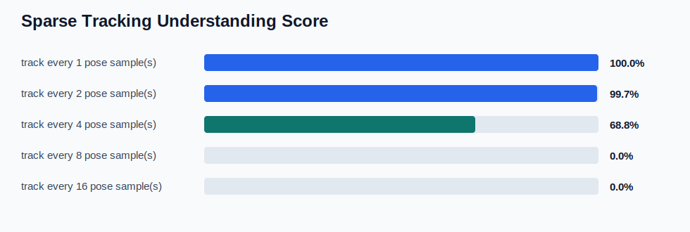
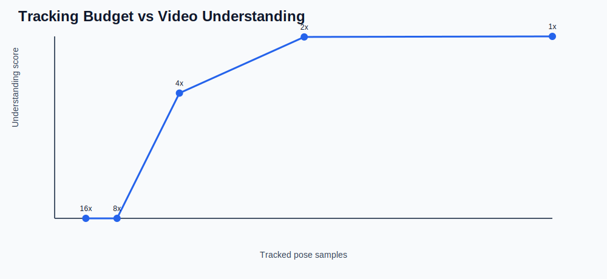

# MotionZip Sparse Understanding Report

This benchmark tests whether MotionZip can preserve the meaningful content of a video segment without tracking every frame.
The dense reference is the existing derived pose timeline; sparse variants simulate lower tracking budgets by taking every Nth pose sample before building MotionZip blocks.

## Summary

| Metric | Value |
| --- | ---: |
| Source video frame span | 2016 |
| Dense reference pose samples | 335 |
| Dense reference sparse blocks | 2 |
| Best sparse understanding score | 100.0% |
| Lowest passing tracked samples | 168 |
| Lowest passing tracked-frame ratio | 8.3% |
| Lowest passing stride (score >= 80%) | 2 |
| Lowest passing effective frame interval | 12 video frames |

## Visuals

## Dense Reference Content

- Activity hint: `lunge_like_unilateral_motion`
- States: `abstain, monitor_only`
- Tags: `2d_fppa_unreliable_extreme, abstain, extreme_angle_geometry_caution, low_keypoint_visibility, lunge_like_unilateral_motion, monitor_only, motion_event_window, pose_geometry_caution, rapid_motion_proxy_high`
- Event frames: `258, 1440`
- Peak velocity: `857.147 deg/s`
- Confidence floor: `0.5145`

## Sparse Variants

| Relative stride | Effective frame interval | Tracked samples | Blocks | Tag recall | State recall | Event coverage | Peak recall | Understanding |
| ---: | ---: | ---: | ---: | ---: | ---: | ---: | ---: | ---: |
| 1 | 6 | 335 | 2 | 100.0% | 100.0% | 100.0% | 100.0% | 100.0% |
| 2 | 12 | 168 | 2 | 100.0% | 100.0% | 100.0% | 98.1% | 99.7% |
| 4 | 24 | 84 | 1 | 77.8% | 50.0% | 50.0% | 90.0% | 68.8% |
| 8 | 48 | 42 | 0 | 0.0% | 0.0% | 0.0% | 0.0% | 0.0% |
| 16 | 96 | 21 | 0 | 0.0% | 0.0% | 0.0% | 0.0% | 0.0% |

## Interpretation

A passing sparse variant means the compressed evidence still identifies the segment as the same activity context, keeps the same conservative state labels, covers the key event windows, and preserves peak motion evidence closely enough for bounded Gemma routing.
This does not mean raw video understanding or clinical correctness. It means the app can avoid per-frame model calls and avoid sending raw video while still giving Gemma the evidence needed for reports, refusal, and summaries.
