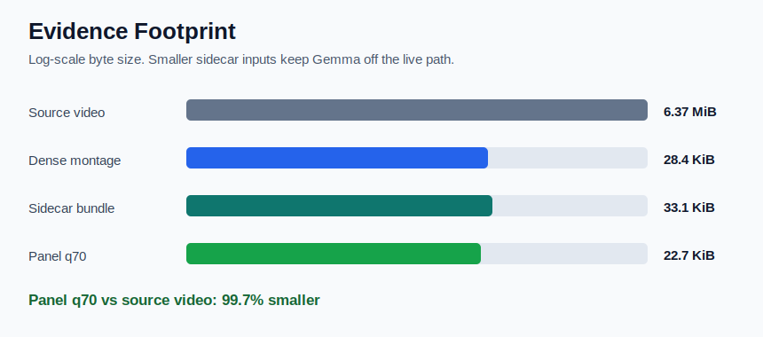
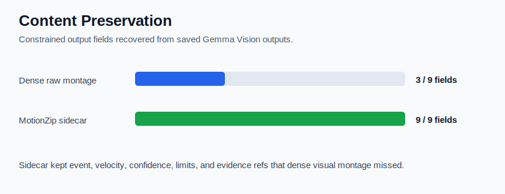
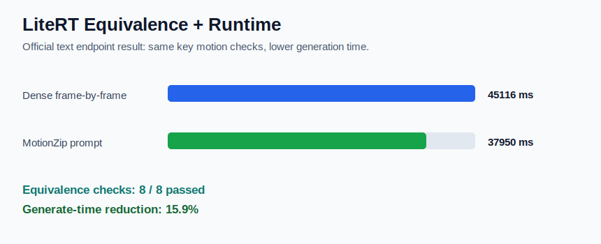
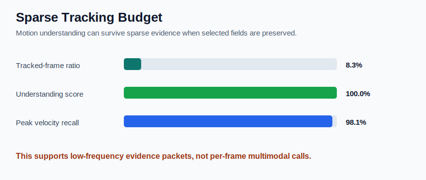
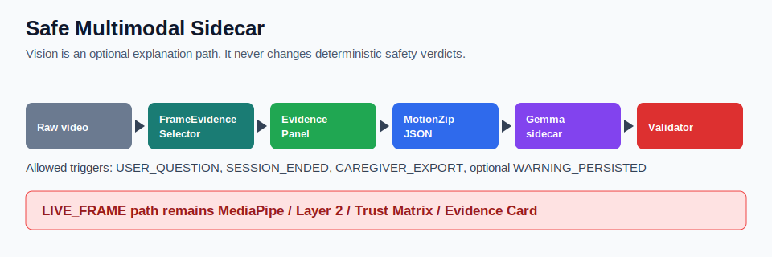
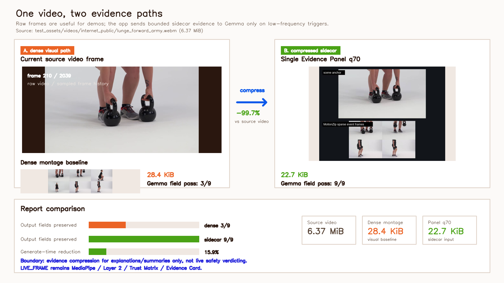

# Multimodal Image Compression Reproof

Date: 2026-05-16

## Conclusion

這次重新整理的結論是：圖片證據壓縮有效，但有效點不是讓壓縮圖自己取代安全判斷。有效點是把 raw video / dense frame history 壓成低頻 Evidence Panel / MotionZip sidecar，仍能保留 Gemma sidecar 需要的 scene、event、velocity、confidence、limits 與 evidence refs。

Live safety path 仍應維持 MediaPipe / Layer 2 / Trust Matrix / Evidence Card；Vision/Gemma 只做低頻解釋與 summary。

## Visual Summary

## Report Video Demo

[MP4 comparison demo](report_video_comparison_demo.mp4)

[Demo notes](report_video_demo_notes.md)

## Byte Size

| Input | Size | Notes |
| --- | ---: | --- |
| Source video | 6.37 MiB | `test_assets/videos/internet_public/lunge_forward_army.webm` |
| Dense raw montage | 28.4 KiB | 6 raw sampled frames in one image |
| Sidecar image bundle | 33.1 KiB | env keyframe + MotionZip event montage + schema |
| Single compressed panel q70 | 22.7 KiB | generated 768px panel |
| Single compressed panel q85 | 31.3 KiB | generated 768px panel |

| Comparison | Result |
| --- | ---: |
| Sidecar bundle vs source video reduction | 99.5% |
| q70 panel vs source video reduction | 99.7% |
| q85 panel vs source video reduction | 99.5% |
| Sidecar bundle vs dense montage byte delta | 16.5% |
| q70 panel vs dense montage reduction | 20.3% |

Important: the sidecar image bundle is slightly larger than the already-compressed dense montage, but it carries the missing event/evidence context. The single q70 panel is smaller than the dense montage and still keeps the selected visual evidence in one image.

## Visual Output Comparison

Source: `docs/benchmark/motionzip_multimodal_sidecar_ab/README.md` saved constrained Gemma Vision outputs.

| Variant | Field pass | Main result |
| --- | ---: | --- |
| Dense raw montage | 3 / 9 | Scene/equipment mostly recovered, event and evidence limits missed |
| MotionZip sidecar | 9 / 9 | Activity/event/velocity/confidence/limits recovered |

| Field | Dense montage | Sidecar |
| --- | --- | --- |
| `activity_guess` | fail: `workout` | pass: `lunge_like_unilateral_motion` |
| `equipment` | pass: `kettlebells` | pass: `kettlebells` |
| `scene` | pass: `white indoor studio` | pass: `white indoor studio` |
| `visible_body_region` | pass: `legs and torso` | pass: `lower_body` |
| `motion_states` | fail: `standing` | pass: `step_or_descent_or_return` |
| `event` | fail: `unknown` | pass: `monitor_only` |
| `velocity_hint` | fail: `moderate` | pass: `high_velocity` |
| `confidence_hint` | fail: `high` | pass: `low_moderate_confidence` |
| `limits` | fail: `unknown` | pass: `single_camera_pose; sampled_video_pose_not_every_frame; no_force_or_grf; no_medical_or_fall_risk_claim` |

## Official LiteRT Text Equivalence

Source: `docs/benchmark/motionzip_equivalence_prompt_endpoint_hardened4_official_2026-05-16/summary.json`

| Metric | Dense frame-by-frame | MotionZip compressed |
| --- | ---: | ---: |
| Output equivalence checks | 8 / 8 | 8 / 8 |
| `generate_content_ms` | 45116 | 37950 |
| Wall time ms | 69258 | 39783 |
| Raw response chars | 822 | 828 |

- Output equivalence: `True` with pass rate `1`.
- Generate-time reduction: 15.9%.
- Wall-time reduction: 42.6%, but this is partly confounded because the dense case includes cold initialization and the compressed case reused the engine.

The official output comparison passed these task-critical checks: activity, states, event count, event frame tolerance, velocity band, velocity peak tolerance, confidence floor, and low-confidence reason.

| Check | Dense output | MotionZip output | Result |
| --- | --- | --- | --- |
| `activity` | `"lunge_like_unilateral_motion"` | `"lunge_like_unilateral_motion"` | pass |
| `states` | `["abstain", "monitor_only"]` | `["abstain", "monitor_only"]` | pass |
| `event_count` | `2` | `2` | pass |
| `event_frames` | `[258, 1440]` | `[258, 1434]` | pass ({"diffs": [0, 6], "tolerance": 6}) |
| `velocity_band` | `"high"` | `"high"` | pass |
| `velocity_peak` | `857.147` | `840.93` | pass ({"relative_error": 0.018919741887914322, "tolerance_ratio": 0.05}) |
| `confidence_floor` | `0.5145` | `0.5145` | pass ({"absolute_error": 0, "tolerance": 0.02}) |
| `low_confidence_reason` | `"low_keypoint_visibility"` | `"low_keypoint_visibility"` | pass |
## Sparse Tracking Reference

| Metric | Value |
| --- | ---: |
| Source frame span | 2016 |
| Dense pose samples | 335 |
| Lowest passing tracked samples | 168 |
| Lowest passing tracked-frame ratio | 8.3% |
| Best sparse understanding score | 100.0% |
| Stride-2 understanding score | 99.7% |
| Stride-2 peak velocity recall | 98.1% |

This supports the same conclusion from the non-visual MotionZip benchmark: the app does not need dense per-frame model input to preserve the key motion facts for bounded summaries.

## Boundaries

- This proves evidence compression / sidecar integration, not raw video understanding.
- This does not make Vision part of `LIVE_FRAME` safety.
- This does not support medical, fall-risk, sarcopenia, force, load, EMG, heart-rate, or clinical-progress claims.
- For product use, compressed image output still needs `MultimodalResultValidator` and evidence-ref checking.
