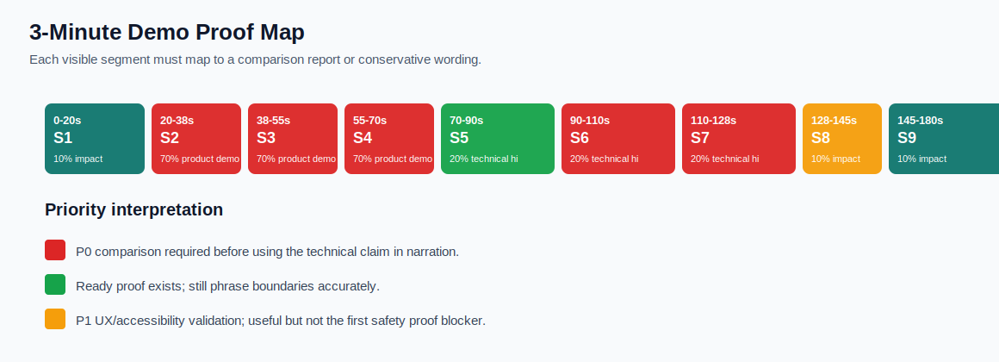
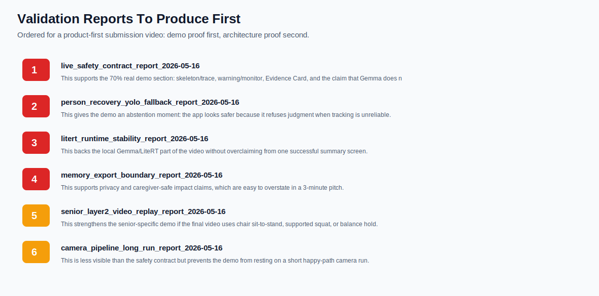

# Video Demo Validation Priority Report

Date: 2026-05-16

## Decision

For the submission video, prioritize validation by what appears on screen. The video can be product-first, but every technical claim needs a comparison proof behind it. The highest-risk missing proof is not MotionZip anymore; it is the live safety contract: `LIVE_FRAME` must stay deterministic, while Gemma/LiteRT only explains or summarizes after evidence exists.

## Visual Summary

## Shot-To-Proof Matrix

| Time | Video content | Technical claim | Proof status | Required comparison report | Use now? |
| --- | --- | --- | --- | --- | --- |
| 0-20s | Problem setup: home exercise needs safe feedback without cloud dependence. | Non-clinical, privacy-preserving movement-quality support; not diagnosis. | `script-ready` | `writeup_claim_boundary_check` | yes, with conservative wording |
| 20-38s | Normal rep: skeleton / trace appears while a movement is analyzed. | The app runs real deterministic pose and motion analysis before any model explanation. | `needs P0 comparison` | `live_safety_contract_report_2026-05-16` | yes for UI run; do not claim full live contract until report exists |
| 38-55s | Monitor / warning rep: unsafe or questionable movement produces a cue. | Safety cues are evidence-bounded, not free-form LLM judgments. | `needs P0 comparison` | `live_safety_contract_report_2026-05-16` | yes for UI proof; add comparison report before technical voiceover |
| 55-70s | Low confidence / abstention: bad view, missing person, occlusion, or multi-person ambiguity. | The app refuses to judge when pose/person evidence is not reliable. | `needs P0 comparison` | `person_recovery_yolo_fallback_report_2026-05-16` | no, needs captured comparison clip |
| 70-90s | Architecture in one line: Pose -> Motion Trace -> Evidence Card -> Local Gemma. | Gemma explains structured evidence; it does not directly watch every frame and guess safety. | `ready` | `multimodal_image_compression_reproof_2026-05-16` | yes |
| 90-110s | Local Gemma / LiteRT summary and explanation. | Summary/explanation runs locally and is constrained by app-owned JSON parsing and validation. | `needs P0 stability` | `litert_runtime_stability_report_2026-05-16` | yes for one controlled run; avoid claiming long-run stability until report exists |
| 110-128s | Privacy boundary: no raw video memory; caregiver-safe export uses structured evidence. | The app stores structured evidence and summaries, not raw video or full landmark history. | `needs P0 privacy audit` | `memory_export_boundary_report_2026-05-16` | only if report is generated or wording stays high-level |
| 128-145s | Senior Mode: large text, conservative cue, voice-friendly flow. | Senior Mode changes interaction policy and safety wording without becoming clinical. | `needs P1 UX capture` | `senior_voice_accessibility_report_2026-05-16` | yes as product UI, but keep technical claim light until UX report |
| 145-180s | Close: trustworthy home movement feedback that knows its limits. | Combined impact comes from local deterministic safety + bounded Gemma explanations. | `script-ready` | `final_video_claim_check` | yes after claim check |

## Priority Report Queue

Generate these reports in this order before locking the final narration.

### 1. live_safety_contract_report_2026-05-16

This supports the 70% real demo section: skeleton/trace, warning/monitor, Evidence Card, and the claim that Gemma does not make live safety verdicts.

Comparison groups:

- LIVE_FRAME vs SESSION_ENDED backend calls
- Deterministic warning/monitor vs Gemma explanation
- Evidence Card refs vs model output refs

Minimum artifacts:

- event log with trigger, verdict, evidence_refs, backend_call_count
- screenshot or screen recording of warning/monitor + Evidence Card
- validator result showing no verdict mutation

Done when:

- LIVE_FRAME backend_call_count == 0
- SESSION_ENDED or USER_QUESTION may call Local Gemma after deterministic evidence exists
- No model output changes WARNING/MONITOR/LOW_CONFIDENCE

### 2. person_recovery_yolo_fallback_report_2026-05-16

This gives the demo an abstention moment: the app looks safer because it refuses judgment when tracking is unreliable.

Comparison groups:

- clean single subject
- no person / blank scene
- occluded or multi-person ambiguity

Minimum artifacts:

- timeline of subjectObserved, subjectStable, poseConfidence, verdict
- screenshot/contact sheet for clean vs ambiguous cases
- YOLO burst count and budget if fallback is triggered

Done when:

- Ambiguous/no-person states do not emit hard warnings
- Stale skeleton is not shown as current evidence
- Recovery path is bounded and auditable

### 3. litert_runtime_stability_report_2026-05-16

This backs the local Gemma/LiteRT part of the video without overclaiming from one successful summary screen.

Comparison groups:

- official LiteRT constrained summary
- deterministic fallback path
- warm vs reinitialized engine

Minimum artifacts:

- parse success and fallback rate
- first token / generate time / p95 latency
- meminfo and thermal/device state

Done when:

- Every output is parseable, refused, or fallbacked
- No crash in a controlled long-ish run
- Report clearly says app-side parsing/validation remains mandatory

### 4. memory_export_boundary_report_2026-05-16

This supports privacy and caregiver-safe impact claims, which are easy to overstate in a 3-minute pitch.

Comparison groups:

- allowed structured caregiver export
- adversarial memory update request
- forbidden raw/clinical payload scan

Minimum artifacts:

- sample export JSON/text
- scan report for raw media/full landmarks/clinical terms
- MemoryWritePolicy accept/reject summary

Done when:

- 0 raw video/frame-history/full-landmark fields
- Every trend note has evidence provenance
- Caregiver export includes non-clinical disclaimer

### 5. senior_layer2_video_replay_report_2026-05-16

This strengthens the senior-specific demo if the final video uses chair sit-to-stand, supported squat, or balance hold.

Comparison groups:

- clean senior activity
- setup transition
- non-senior lunge/basketball demotion

Minimum artifacts:

- event timeline with phase/activity/judgeability
- real-video contact sheet
- non-senior demotion and abstain counts

Done when:

- No hard senior judgment on non-senior clips
- Every senior event has evidence_refs
- Ambiguous context is abstain/AMBIGUOUS

### 6. camera_pipeline_long_run_report_2026-05-16

This is less visible than the safety contract but prevents the demo from resting on a short happy-path camera run.

Comparison groups:

- short smoke vs long foreground run
- front/back and rotation variants
- frame timing and memory over time

Minimum artifacts:

- 30s/10m timing summary
- meminfo/gfxinfo snapshots
- camera rotation screenshots or audit events

Done when:

- No sustained frame starvation
- No crash/memory creep beyond documented threshold
- Orientation and frame dimensions match the active pipeline

## Ready-To-Use Proofs

- MotionZip / sidecar difference: `docs/benchmark/multimodal_image_compression_reproof_2026-05-16/report.md` and `report_video_comparison_demo.mp4`.
- Live safety preflight: `docs/benchmark/live_safety_contract_preflight_2026-05-16/report.md`.
- Pixel summary flow: `docs/benchmark/pixel_demo_flow_smoke_2026-05-16/README.md`.
- Constrained LiteRT JSON parse: `docs/benchmark/litert_prompt_smoke_constrained_100_official_2026-05-16/report.md`.
- Layer 2 unit/device smoke: `docs/benchmark/layer2_senior_activity_ab_2026-05-16/README.md`.

## Narration Rules

- Say: "Gemma explains structured evidence after the app has already decided what is judgeable."
- Say: "When confidence is low, GemmaFit abstains instead of guessing."
- Say: "Local Gemma runs on device for summaries/explanations, with app-side validation."
- Do not say: "Gemma watches live video and detects safety risks."
- Do not say: "This predicts fall risk, sarcopenia, force, load, EMG, heart rate, or clinical progress."

## Validation Acceptance Rule

A final video claim is allowed only if one of these is true:

1. It maps to a generated comparison report in this folder or `docs/benchmark`.
2. It is shown purely as UI behavior without a technical claim.
3. It is phrased as an implementation boundary or future optional path, not a proven result.
