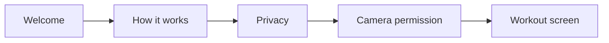

# Onboarding Flow

## Purpose

The first-run flow sets expectations quickly: GemmaFit coaches form on-device, uses the camera for pose landmarks, and gives coaching guidance rather than medical diagnosis.

## Flow

## Slides

### 1. Welcome

Title: `Your Pocket Trainer`

Subtitle: `Real-time form coaching without leaving your phone`

Body: `AI-powered form coaching that works offline, on your phone.`

### 2. How It Works

Title: `How It Works`

Subtitle: `Your phone sees, AI coaches`

Body: `Camera tracks your movement. AI analyzes joint angles and gives instant voice feedback when form needs correction.`

### 3. Privacy

Title: `100% Private`

Subtitle: `Everything stays on your phone`

Body: `No internet needed. No account required. No video is uploaded for coaching.`

### 4. Camera Permission

Title: `Almost Ready`

Subtitle: `We need camera access`

Body: `Camera permission is required to analyze posture in real time.`

Primary action: `Grant Camera Access`

Final action: `Start Workout`

## UX Notes

- No sign-up before first workout.
- Skip remains available before the permission page.
- Camera permission is requested only on the permission slide.
- Privacy copy must not overclaim storage behavior until camera/session persistence is implemented.

## Current Compose Implementation

- `app/src/main/kotlin/com/gemmafit/ui/screens/OnboardingScreen.kt`

The current screen uses four slides, page indicators, a green primary CTA, and Android runtime camera permission handling.
