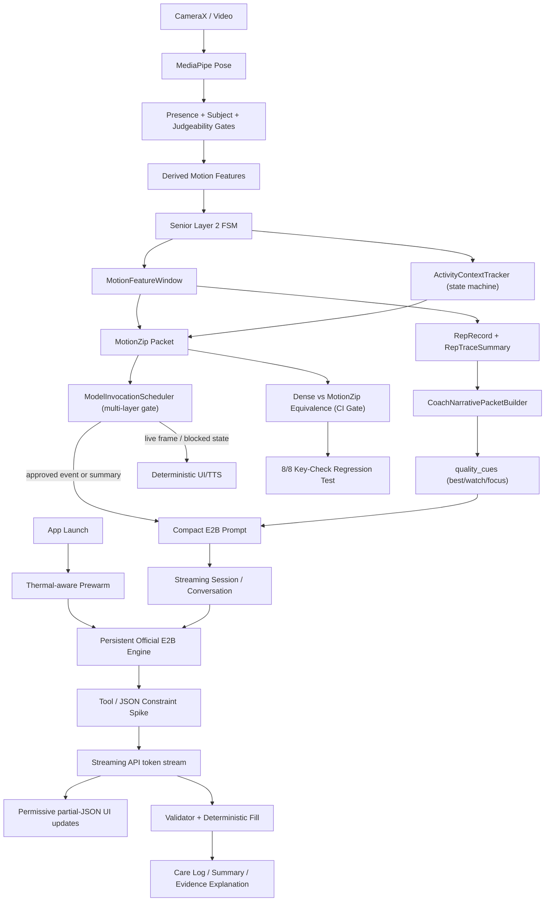

# Official E2B + MotionZip Runtime Architecture (v2)

This document supersedes v1 (2026-05-15). v2 absorbs:

- Mali-G715 field report (LiteRT-LM Issue #2202): GPU numerical corruption,
  tool-call argument degradation, silent parser drops, hang patterns
- Gemma 4 official chat-template and function-calling format
- LiteRT-LM optimization patterns verified against the current Android AAR:
  async streaming APIs exist; conversation constrained decoding and
  speculative decoding exist as experimental flags/capability checks; direct
  `Session.clone()` is **not** exposed in `litertlm-android:0.11.0-rc1`
- ActivityContextTracker design as P0 replacement for vision-based
  exercise disambiguation
- App-launch background prewarm (replacing v1's 70% analysis-progress trigger)
- Video summary quality pass: `CoachNarrativePacketBuilder` now emits compact
  `quality_cues` (`best`, `watch`, `focus`) for session-summary wording without
  expanding raw video or per-frame model input.
- Live TTS cadence is controlled outside the model by `VoiceCuePolicy`
  cooldowns, rolling spoken budgets, and a bounded queue.

Source benchmark:
`docs/benchmark/edge_gallery_official_e2b_litert_smoke_2026-05-15.md`.

## v1 ??v2 Summary of Changes

- ActivityContextTracker upgraded to P0 (replaces vision sidecar's primary
  use case of chair-vs-squat disambiguation; pose-temporal state machine,
  near-zero cost)
- Vision sidecar downgraded P2 ??P3 (defer until ActivityContextTracker
  proven insufficient)
- Tool schema kept at 4 args (`headline`, `observations`, `next_focus`,
  `evidence_refs`). P0 enforcement remains Android validation +
  deterministic fill; constrained decoding is a spike until the current
  Android API path passes smoke tests
- Prewarmed persistent engine/session strategy for static-prefix reuse;
  `Session.clone()` remains a P1 spike because it is not exposed in the
  current Android Kotlin API
- Async streaming UI for first-token-time perception
- App-launch prewarm (TTL 10 min) replacing per-session prewarm trigger
- Chat template aligned to official Gemma 4 format with closing `<turn|>`
  markers
- `<|think|>` thinking mode enabled for session_summary
- GPU?PU automatic retry on JSON parse failure
- Critical instruction placed at prompt END to exploit hybrid attention
  sliding window

## Decision (v2)

P0 stack:

```text
Official Gemma-4-E2B-it LiteRT (multimodal artifact, used in text mode)
+ ActivityContextTracker (pose-temporal activity state machine)
+ MotionZip compact evidence + CoachNarrativePacket (rep_summaries +
  session_trend + baseline_comparison + quality_cues)
+ Constrained decoding spike (conversation/tool constrained decoding path)
+ Prewarmed persistent official E2B engine/session
+ Async streaming UI (`generateContentStream` / `sendMessageAsync`)
+ App-launch background prewarm (thermal-aware, TTL-managed)
+ Android JSON cleanup, validator, deterministic fill
+ Deterministic fallback renderer
```

P0 explicitly NOT required:

```text
GemmaFit v5 fine-tuned LiteRT artifact  (P1, gated by explicit eval criteria)
FunctionGemma 270M router               (P2)
Vision sidecar                          (P3 - defer until needed)
Frame-by-frame model calls              (never)
Raw video or raw landmark memory        (never)
```

The product claim becomes: **GemmaFit's evidence architecture lets the
official baseline reproduce all task-critical facts**. v5 is reserved for
demonstrably better wording, not as proof MotionZip works.

## High-Level Runtime



## Runtime Paths

| Path | Purpose | Backend | Deadline role |
| --- | --- | --- | --- |
| Live deterministic path | Pose, phase, event, pause, simple cue, rep state | Kotlin / C++ / MediaPipe | Required P0 |
| ActivityContextTracker | Activity disambiguation (chair_sts vs squat etc.) | Pure Kotlin state machine | Required P0 |
| Official E2B text path (streaming) | Summary, care log, evidence explanation, refusal | LiteRT-LM GPU + CPU retry | Required P0 |
| Prewarmed persistent engine | Hide 9.7s init from user | LiteRT-LM GPU (background) | Required P0 |
| MotionZip equivalence harness | Dense-vs-compressed CI regression | Debug endpoint, CI-only | Required P0 (gate) |
| GemmaFit v5 router | Better schema fidelity / wording (if eval passes gates) | LiteRT-LM GPU | Optional P1 |
| FunctionGemma 270M | Fast routing if E2B too slow even after v2 | LiteRT-LM CPU/GPU/NPU | Optional P2 |
| Vision sidecar | Scene/equipment confirmation (only if ActivityContextTracker insufficient) | LiteRT image path | Optional P3 |

## ActivityContextTracker (NEW P0)

State machine with hysteresis to disambiguate visually-similar activities
(squat vs supported chair squat, lunge vs split squat, etc.) using
pose-only signals over a temporal window.

### States

```text
UNKNOWN          - session start / no completed rep
CALIBRATING      - first rep complete, scoring all templates
LOCKED(template) - N consecutive reps confirm one template
SUSPECT_SWITCH   - LOCKED but recent rep contradicts
AMBIGUOUS        - multiple templates score within margin ??generic cues
```

### Scoring features (chair_sts vs squat example)

| Feature | chair_sts signature | squat signature |
| --- | --- | --- |
| Hip y-dwell at bottom | long dwell at seat height | brief bounce |
| Trunk forward lean during descent | 30-45簞 | 15-30簞 |
| Hand keypoint position relative to hip | wrist back/low (chair support) | neutral |
| Phase profile | discrete sit?well?ift?tand | continuous descend?scend |

Each feature scored 0-1, weighted average ??`templateScores[t]`.

### Output

```kotlin
data class ActivityContext(
    val state: ActivityContextState,
    val template: String?,        // null when UNKNOWN/CALIBRATING/AMBIGUOUS
    val confidence: Float,
    val ambiguityNote: String?,   // explicit "knows its limits" message
    val evidenceRefs: List<String>,
)
```

`AMBIGUOUS` state is the trust card ??system explicitly outputs "Mode
unclear after N reps; using generic controlled-tempo guidance" rather
than picking a wrong template.

## P0 Model Contract (v2)

The official model is a bounded writer over deterministic evidence.

### Input

```text
<|turn>system
[1-line concise role + safety statement, no narrative bloat]
<turn|>
<|turn>user
```json
{
  "trigger": "SESSION_SUMMARY",
  "compressed_session_memory": {activity, duration, reps, person_state},
  "event_index": [{kind, severity, evidence_ref}],         // max 4
  "rep_summaries": [{rep, quality_note, tempo_band, ...}], // max 4
  "session_trend": {early_session, late_session, ...},
  "quality_cues": {best, watch?, focus},                   // compact video quality pass
  "baseline_comparison": {...} | null,
  "evidence_refs": [...],                                  // max 4
  "output_contract": {function, required_args}
}
```
[Critical instruction at end - exploits sliding-window final-layer-global attention]
Required: call create_care_activity_log with all 4 args. Cite only listed
evidence_refs. Use rep_summaries and quality_cues to cite rep numbers and
choose one next focus. JSON only.
<turn|>
<|turn>model
<|think|>
```

### Output (schema target)

```json
{
  "function": "create_care_activity_log",
  "args": {
    "headline": "<= 80 chars",
    "observations": "<= 180 chars, cites rep numbers",
    "next_focus": "<= 140 chars",
    "evidence_refs": ["..."]
  }
}
```

JSON schema enforces: function name, required args, max field lengths,
evidence_refs as array of max 4 strings.

### Android-side responsibilities

- partial-JSON streaming parse (update UI as fields complete)
- evidence-ref whitelist validation
- forbidden-claim rejection (RefusalValidator - **primary** safety net
  since official model not refusal-trained)
- deterministic fill for omitted args (`caregiver_note`, `not_judged`,
  `what_was_completed`, `selection_basis` from compressed_session_memory
  and event_index)
- deterministic fallback rendering when validation fails

## LiteRT-LM Optimization Layers

### Layer A: Prewarm and Prefix-Reuse Spike

Static prefix (~400-500 tokens) should be kept stable so the runtime can reuse
whatever cache behavior LiteRT-LM exposes. The current Android dependency,
`com.google.ai.edge.litertlm:litertlm-android:0.11.0-rc1`, exposes
`Engine.createSession`, `Session.runPrefill`, `Session.runDecode`,
`Session.generateContent`, and `Session.generateContentStream`, but it does
**not** expose `Session.clone()`.

P0 should therefore rely on a persistent prewarmed `Engine` and measured prompt
compaction. KV/session cloning is a P1 spike only if a newer API exposes it.

### Layer B: Constrained decoding

The current AAR exposes `ExperimentalFlags.enableConversationConstrainedDecoding`
and `OpenApiTool` / `InternalJsonTool` surfaces. It does not expose an arbitrary
JSON-schema field on `SessionConfig`.

P0 constrained-output work should use conversation/tool constrained decoding
if it passes smoke tests. Until then, the primary safety net remains Android
JSON cleanup, schema validation, evidence-ref validation, forbidden-claim
rejection, and deterministic fallback. Do not count constrained decoding as
"solved" until the 100-run smoke gate passes.

### Layer C: Async streaming UI

Supported API surfaces:

- `Session.generateContentStream(inputs, ResponseCallback)`
- `Conversation.sendMessageAsync(...)`

P0 can stream tokens into a permissive partial-JSON parser while keeping the
final rendered result gated by the full validator.

User sees: deterministic insight (0s) + spinner ??first token (~3s) ??incremental field completion ??done (~10-12s).

### Layer D: MTP / speculative decoding (P1 spike)

LiteRT-LM C++ doc: "significantly accelerates decode on GPU". Spike to
verify Gemma 4 E2B `.litertlm` support. If supported: -30% to -50% decode.

### Layer E: Thermal-aware prewarm

Check `PowerManager.thermalStatus` before prewarm. Skip if `THROTTLED` or
higher. Defer to first session_summary trigger as fallback.

### Layer F: App-launch background prewarm

Replaces v1's 70%-progress trigger. Prewarm at app launch (background,
low priority). TTL 10 min. Engine 2.5GB safe on 12GB Pixel 8 Pro RAM.

Current implementation status (2026-05-16): `MainActivity` starts a
debug-build official E2B prewarm on a background `GemmaFitLiteRtPrewarm`
thread, skips when Android reports `THERMAL_STATUS_SEVERE` or higher, and
uses a 10-minute cooldown. Pixel 8 Pro validation completed with thermal
status `light`, backend `litert-lm:isolated:gpu`, and engine initialize time
14,141 ms.

## Performance Position

Measured baseline (v1, Pixel + Edge Gallery official E2B):

| Metric | v1 baseline | v2 target | Path |
| --- | ---: | ---: | --- |
| Model size | 2.5 GB | unchanged | - |
| GPU prewarm | 9.7s | invisible | App-launch prewarm |
| Warm prompt prefill | ~10s | measure | Persistent engine + prompt compaction |
| Warm prompt decode | ~13s | ~6-8s target | Smaller schema + streaming + optional MTP |
| User-perceived first content | 23.3s | **~3s** | Async streaming (Layer C) |
| User-perceived full content | 23.3s | **~10-12s** | All combined |
| MotionZip equivalence checks | 8/8 | 8/8 | CI gate |
| JSON parse success rate | needs measured baseline | **??9% target** | Tool-constrained decoding if verified + CPU retry + validator |

P0 scheduler rule (unchanged from v1):

```text
Do not call E2B on live frames.
Do not call E2B for no-person, lost-subject, no-response, multi-person.
Use E2B only for approved event explanations, session summaries,
caregiver logs, and bounded unsupported-question refusals.
```

## MotionZip Proof vs Product Runtime

The equivalence harness is intentionally heavier than product runtime:

```text
Dense prompt + MotionZip prompt + two model generations + comparison
```

8/8 key checks (activity, state list, event count, event frame, velocity
band, peak velocity, confidence floor, low-confidence reason) become a
**CI regression gate** in v2 ??every prompt-shape change re-runs this
benchmark and blocks commit on regression.

Product runtime uses MotionZip prompt only on prewarmed cloned-session.

### Current 2026-05-16 Harness Status

Implemented:

- debug endpoint accepts `max_tokens` for MotionZip equivalence probes
- isolated LiteRT-LM engine tracks the requested token budget
- `backend=auto` is no longer treated as a forced single backend
- `tools/run_litert_prompt_smoke.ps1` can run repeated official E2B JSON smoke
  tests from adb and write summary artifacts
- `tools/run_litert_prompt_smoke.ps1` now supports `-Constrained` plus bounded
  thermal abort (`-MaxThermalPauseCycles`) so long runs write a clean partial
  summary instead of hanging forever while the device is SEVERE
- `tools/run_motionzip_equivalence_prompt_endpoint.ps1` runs dense and
  MotionZip prompt cases as separate `litert_prompt_infer` calls, avoiding the
  raw single-endpoint OOM path
- `ActivityContextTracker` is implemented as a pure Kotlin event-level state
  machine. It scores `chair_sit_to_stand` vs `supported_squat`, emits
  `AMBIGUOUS` instead of false-locking when scores are close, and writes
  `activity_context` into MotionZip packets.

Measured:

- short official E2B JSON smoke: 2 / 2 parseable JSON on
  `litert-lm:isolated:gpu`; this only proves the harness is working, not the
  100-run gate
- 100-run constrained official E2B JSON smoke now passes:
  `docs/benchmark/litert_prompt_smoke_constrained_100_official_2026-05-16/summary.json`
  - endpoint success: 100 / 100
  - generation success: 100 / 100
  - JSON parse success: 100 / 100
  - backend: `litert-lm:isolated:gpu`
  - wall p50 / p95: 34.3s / 45.2s
  - generate p50 / p95: 24.8s / 26.5s
  - thermal abort: none; final observed thermal status remained `1`
- Conversation constrained decoding did not deadlock in the 100-run smoke, but
  official E2B did **not** emit LiteRT native tool calls in this path
  (`tool_calls` / `tool_executions`: 0 / 100). P0 enforcement therefore remains
  JSON-only prompting + parser + Android validator + deterministic fill, not a
  proven native tool-call constrained decoder.
- Async summary UI now publishes nonblocking `queued`, `prefill`, `streaming`,
  `validating`, and `complete` states to the summary panel and debug state.
- True token-level streaming is implemented on the isolated summary path via
  `Session.generateContentStream` over the debug provider JSONL pipe:
  `docs/benchmark/litert_prompt_stream_dev_2_warm_official_2026-05-16/summary.json`
  - warm/reused-engine parse success: 2 / 2
  - first token after generation start: 3.14s then 0.96s
  - first token wall time from provider start: 3.16s then 0.96s
  - full generation still takes ~22.5-25.2s, so streaming improves perceived
    latency but does not reduce total decode time.
- Cold stream still includes engine init. Example:
  `docs/benchmark/litert_prompt_stream_dev_1_official_2026-05-16/summary.json`
  produced first token at 2.67s after generation start but ~15.97s from
  provider start because engine initialize took 13.3s. App-launch prewarm is
  therefore required for the <=5s user-visible first-content target.
- host-side MotionZip equivalence in extract mode completed without OOM but
  produced 3 / 8 checks because the official model was allowed to freely
  re-summarize dense and compressed evidence
- host-side MotionZip equivalence in `canonical_copy` mode passed 8 / 8 checks
  with official E2B:
  `docs/benchmark/motionzip_equivalence_prompt_endpoint_hardened4_official_2026-05-16/summary.json`
- unit tests cover ActivityContextTracker lock behavior, ambiguous
  chair-vs-squat behavior, and MotionZip packet propagation:
  `ActivityContextTrackerTest`, `Layer2TemporalInterpreterTest`,
  `ModelInvocationSchedulerTest`, `MotionZipPacketBuilderTest`
- unit tests cover the video summary quality pass and prompt budget:
  `CoachNarrativePacketBuilderTest`, `LiteRtSessionSummaryPromptTest`
  (`quality_cues` remains inside the 3000-char slim prompt gate)

Therefore the current proof path is: deterministic extraction builds
`EXPECTED_KEY_MOTION_UNDERSTANDING`, official E2B copies that bounded contract,
and the host harness compares dense vs MotionZip outputs on task-critical
fields. The remaining gap is CI ergonomics: the single Android
`motionzip_model_equivalence` endpoint still has an OOM failure and should not
be used as the primary live-path benchmark.

## Camera RGBA/RGB Pipeline Audit

The live camera path now has debug-only instrumentation for the CameraX color
format and Bitmap conversion path. It does not alter inference behavior.

Current measured fields:

- `ImageProxy.format` and plane count
- proxy dimensions and rotation
- raw and post-rotation `Bitmap.Config`
- `ImageProxy.toBitmap()` time
- rotation time
- `BitmapImageBuilder` build time
- `PoseLandmarker.detectAsync` enqueue time
- appearance-snapshot `ARGB_8888` copy time
- total accepted-frame preprocessing time

Debug endpoints:

```powershell
adb shell content read --uri content://com.gemmafit.debug/rgba_pipeline_audit
adb shell content read --uri 'content://com.gemmafit.debug/rgba_pipeline_audit?reset=true'
```

Host-side 30s collection:

```powershell
powershell -NoProfile -ExecutionPolicy Bypass -File tools\run_rgba_pipeline_audit.ps1 -DurationSeconds 30
```

This closes the audit-instrumentation gap. Actual zero-copy or RGB/RGBA
pipeline optimization remains a separate change and should be based on the p95
numbers from a real live-camera run.

## V5 Repositioning (with eval gates)

GemmaFit v5 stays P1. Use v5 only when **all** of these are demonstrably
better than official E2B + v2 stack:

| Criterion | Threshold | Test |
| --- | --- | --- |
| Schema fidelity | v5 JSON parse success > official + 5% | 100 cases |
| Evidence-ref precision | v5 cites only whitelisted refs > official + 5% | 100 cases |
| Latency | v5 warm inference ??1.5? official | benchmark |
| Senior wording | v5 RefusalValidator passes ??official | 50 senior-care cases |

Without these gates, v5 stays optional and the official baseline ships.

## Vision Repositioning (P2 ??P3)

ActivityContextTracker (Kotlin state machine, pose-only, ~0 cost) handles
the chair-vs-squat ambiguity that motivated vision sidecar.

Vision deferred to P3, only added when:

- ActivityContextTracker `AMBIGUOUS` state happens > 20% of sessions
- OR specific use case requires environmental understanding (assisted
  living, fall hazard detection)

When added, vision is **triggered, not always-on**: max 1-3 vision calls
per session at session-start scene cache + low-confidence disambiguation.

## Acceptance Gates (v2)

P0 ships when:

- [ ] `model_readiness` selects official E2B by default; v5 selectable
      via debug override
- [ ] `litert_prewarm` succeeds on GPU at app launch
- [x] Warm `litert_prompt_infer` produces parseable JSON >= 99% (over 100
      runs against the smoke set)
- [ ] MotionZip equivalence benchmark reports 8/8 key checks (CI gate,
      not just one-off)
- [ ] App validator rejects invalid refs and forbidden claims
- [ ] Live frames, blocked tracking states, support states skip E2B
- [x] ActivityContextTracker emits `AMBIGUOUS` state for genuinely
      ambiguous test footage (instead of false-positive lock)
- [x] Async streaming first-token-time <= 5s on prewarmed/reused official E2B
      engine (observed 0.96-3.14s in 2-run smoke; cold init still exceeds this)
- [ ] Summary/export path shows backend, model file, elapsed time per
      stage, fallback status, and evidence refs
- [x] Tool/conversation constrained decoding, if enabled, does not deadlock
      (no infinite-token-search
      cases in 100-run smoke; native tool calls were not observed, so validator
      remains mandatory)
- [ ] Thermal check skips prewarm cleanly when device is `THROTTLED`+

## Implementation Priorities (v2 ordered by ROI)

1. **Async streaming UI** ??biggest perceived-latency win, 4-6 hr
2. **App-launch prewarm + thermal check** ??9.7s init hidden, 1-2 hr
3. **Tool/conversation constrained decoding spike** ??use exposed
   `ExperimentalFlags` and tool surfaces only if smoke passes, 4-6 hr
4. **Prompt compaction + stable static prefix** ??measure prefill savings,
   2-4 hr
5. **ActivityContextTracker** ??implemented for event-level MotionZip packets
6. **CoachNarrativePacket + quality_cues** ??implemented video summary quality
   pass for rep-level signal and one concrete next focus
7. **Chat template format alignment** (closing markers + thinking mode), 1-2 hr
8. **MTP spike** (verify Gemma 4 E2B support) ??possible -30% decode, 1 hr spike
9. **GPU?PU retry on JSON parse fail** ??extra 6-9% success, 1 hr
10. **Equivalence harness CI gate** ??long-term regression safety, 2-3 hr
11. **Benchmark expansion** (RAM peak, p95, thermal-after-5min) ??writeup, 2 hr
12. **Per-stage timing already in place** ??done

## Out of scope for this iteration

- Vision sidecar (P3, deferred until ActivityContextTracker insufficient
  proven)
- v5 promotion (gated by eval criteria above)
- Real-time per-rep LLM rewriting (still infeasible at 6-8s decode)
- Selective build / binary-size optimization
- Camera RGB/RGBA zero-copy optimization (audit instrumentation now exists;
  optimization remains a separate workstream)
- LiteRT op-level graph surgery (using Google pre-built artifacts)

## References

### Official Gemma 4 / LiteRT-LM

- [Gemma 4 model overview](https://ai.google.dev/gemma/docs/core)
- [Gemma 4 prompt formatting (chat template)](https://ai.google.dev/gemma/docs/core/prompt-formatting-gemma4)
- [Function calling with Gemma 4](https://ai.google.dev/gemma/docs/capabilities/text/function-calling-gemma4)
- [Gemma 3n / E2B per-layer embeddings overview](https://ai.google.dev/gemma/docs/gemma-3n)
- [On-device GenAI with LiteRT-LM (Google Developers Blog, 2025-09)](https://developers.googleblog.com/on-device-genai-in-chrome-chromebook-plus-and-pixel-watch-with-litert-lm/)
- [LiteRT-LM C++ API: Engine, Conversation, MTP, constrained decoding](https://ai.google.dev/edge/litert-lm/cpp)
- [LiteRT GenAI overview](https://ai.google.dev/edge/litert/genai/overview)

### Field reports & engineering optimization

- [Mali-G715 field report ??10 findings (LiteRT-LM Issue #2202)](https://github.com/google-ai-edge/LiteRT-LM/issues/2202)
- [LiteRT performance best practices](https://ai.google.dev/edge/litert/conversion/tensorflow/build/best_practices)
- [LiteRT GPU delegate optimization](https://ai.google.dev/edge/litert/performance/gpu)
- [Bringing multimodal Gemma 4 E2B to the edge (LiteRT-LM + QNN)](https://medium.com/google-developer-experts/bringing-multimodal-gemma-4-e2b-to-the-edge-a-deep-dive-into-litert-lm-and-qualcomm-qnn-4e1e06f3030c)

### Prompt compression & constrained generation research

- [LLMLingua-2 (Microsoft Research, ACL 2024)](https://arxiv.org/abs/2403.12968)
- [Microsoft Guidance project](https://www.microsoft.com/en-us/research/project/guidance-control-lm-output/)

### Internal benchmark

- `docs/benchmark/edge_gallery_official_e2b_litert_smoke_2026-05-15.md`
