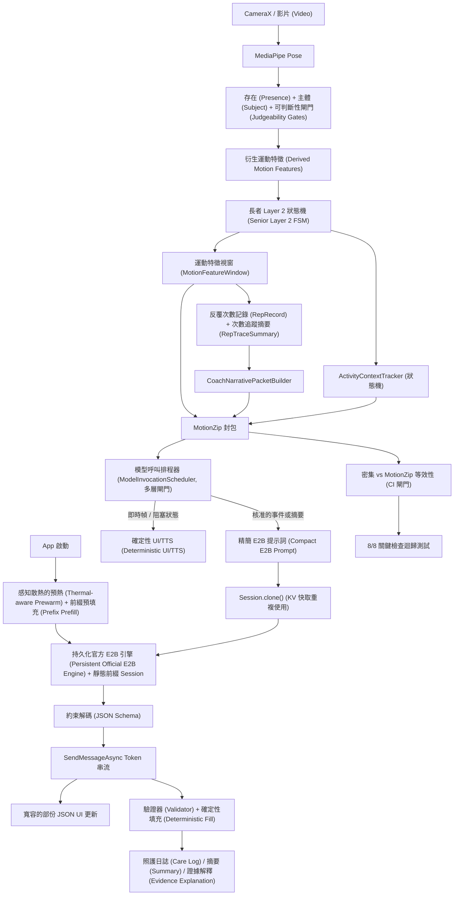

# 官方 E2B + MotionZip 運行時架構 (v2)

本文檔取代 v1 (2026-05-15)。v2 吸收了：

- Mali-G715 現場報告 (LiteRT-LM Issue #2202)：GPU 數值損壞、工具呼叫參數退化、解析器靜默丟棄、當機模式
- Gemma 4 官方對話模板 (chat-template) 與函數呼叫 (function-calling) 格式
- LiteRT-LM 最佳化模式 (透過 Session.clone 進行前綴快取、約束解碼、非同步串流、MTP)
- ActivityContextTracker 設計成為基於視覺的運動消歧義的 P0 替代方案
- App 啟動時背景預熱 (取代 v1 的 70% 分析進度觸發)

來源基準測試：
`docs/benchmark/edge_gallery_official_e2b_litert_smoke_2026-05-15.md`.

## v1 → v2 變更摘要

- ActivityContextTracker 升級至 P0 (取代視覺 sidecar 的主要用例：椅子深蹲 vs 自由深蹲消歧義；基於姿態時間序列的狀態機，近乎零成本)
- 視覺 sidecar 降級 P2 → P3 (推遲到 ActivityContextTracker 證明不足時再使用)
- 工具結構描述 (Tool schema) 保持 4 個參數 (`headline`, `observations`, `next_focus`, `evidence_refs`)，但由**約束解碼 (JSON schema)** 強制執行，而非僅靠提示詞指令 — 解決了 Mali 發現 2 (4個參數→0% 通過率)
- 透過 `Session.clone()` 進行提示詞前綴快取，實現靜態前綴重複使用
- 非同步串流 UI，提升首個 token 時間 (first-token-time) 感知
- App 啟動預熱 (TTL 10 分鐘) 取代每個 session 的預熱觸發
- 對話模板對齊官方 Gemma 4 格式，包含閉合的 `<turn|>` 標記
- 為 session_summary 啟用 `<|think|>` 思考模式
- 在 JSON 解析失敗時，自動從 GPU 退回 CPU 重試
- 關鍵指令置於提示詞結尾，以利用混合注意力 (hybrid attention) 滑動視窗

## 決策 (v2)

P0 堆疊：

```text
官方 Gemma-4-E2B-it LiteRT (多模態產物，在此用於純文字模式)
+ ActivityContextTracker (姿態時間序列活動狀態機)
+ MotionZip 壓縮證據 + CoachNarrativePacket (次數摘要 + 訓練趨勢 + 基準對比)
+ 約束解碼 (JSON Schema 強制執行)
+ 提示詞前綴快取 (具有 KV 重複使用的 Session.clone)
+ 非同步串流 UI (SendMessageAsync + 寬容的部份 JSON 解析器)
+ App 啟動背景預熱 (感知散熱，TTL 管理)
+ Android 端 JSON 清理、驗證器、確定性填充
+ 確定性備用渲染器
```

P0 明確不需要：

```text
GemmaFit v5 微調版 LiteRT 模型 (P1，由明確的評估標準把關)
FunctionGemma 270M 路由器        (P2)
視覺 Sidecar                     (P3 - 延遲至需要時)
逐幀模型呼叫                      (絕不)
原始影片或原始特徵點記憶庫         (絕不)
```

產品聲明變成：**GemmaFit 的證據架構讓官方基準模型能夠重現所有任務關鍵事實**。v5 保留用於提供明顯更好的措辭，而不是用來證明 MotionZip 有效。

## 高階運行時架構



## 運行路徑

| 路徑 (Path) | 目的 (Purpose) | 後端 (Backend) | 截止角色 (Deadline role) |
| --- | --- | --- | --- |
| 即時確定性路徑 (Live deterministic path) | 姿態、階段、事件、暫停、簡單提示、次數狀態 | Kotlin / C++ / MediaPipe | Required P0 |
| ActivityContextTracker | 活動消歧義 (椅子深蹲起立 vs 自由深蹲等) | 純 Kotlin 狀態機 | Required P0 |
| 官方 E2B 文字路徑 (串流) | 摘要、照護日誌、證據解釋、拒絕回答 | LiteRT-LM GPU + CPU 重試 | Required P0 |
| 前綴快取預熱引擎 (Prefix-cached prewarm engine) | 向使用者隱藏 9.7 秒的初始化時間 | LiteRT-LM GPU (背景) | Required P0 |
| MotionZip 等效性測試線束 (equivalence harness) | 密集 vs 壓縮 的 CI 迴歸測試 | 除錯端點 (Debug endpoint)，僅供 CI | Required P0 (閘門) |
| GemmaFit v5 路由器 | 更好的 Schema 保真度 / 措辭 (如果評估通過閘門) | LiteRT-LM GPU | Optional P1 |
| FunctionGemma 270M | 如果引入 v2 後 E2B 仍然太慢，則提供快速路由 | LiteRT-LM CPU/GPU/NPU | Optional P2 |
| 視覺 sidecar | 場景/器材確認 (僅當 ActivityContextTracker 不足時) | LiteRT 影像路徑 | Optional P3 |

## ActivityContextTracker (新 P0)

具有磁滯效應 (hysteresis) 的狀態機，用於在一個時間視窗內僅使用姿態訊號，來消歧義視覺上相似的活動 (深蹲 vs 有支撐的椅子深蹲，弓步 vs 分腿蹲等)。

### 狀態 (States)

```text
UNKNOWN          - session 開始 / 尚未完成任何次數 (rep)
CALIBRATING      - 第一次數完成，正在對所有模板進行評分
LOCKED(template) - N 次連續次數確認了同一個模板
SUSPECT_SWITCH   - 處於 LOCKED 狀態，但最近的次數與之矛盾
AMBIGUOUS        - 多個模板的評分在誤差範圍內 → 使用通用提示
```

### 評分特徵 (以椅子深蹲起立 vs 深蹲為例)

| 特徵 (Feature) | 椅子起立特徵 (chair_sts signature) | 深蹲特徵 (squat signature) |
| --- | --- | --- |
| 底部臀部 Y 軸停留時間 (Hip y-dwell at bottom) | 長時間停留在座椅高度 | 短暫反彈 |
| 下降時軀幹前傾 (Trunk forward lean during descent) | 30-45° | 15-30° |
| 手部特徵點相對於臀部的位置 (Hand keypoint position relative to hip) | 手腕靠後/較低 (支撐在椅子上) | 中立位 |
| 階段輪廓 (Phase profile) | 離散：坐下→停留→抬起→站立 | 連續：下降→上升 |

每個特徵評分 0-1，加權平均 → `templateScores[t]`。

### 輸出 (Output)

```kotlin
data class ActivityContext(
    val state: ActivityContextState,
    val template: String?,        // 當處於 UNKNOWN/CALIBRATING/AMBIGUOUS 時為 null
    val confidence: Float,
    val ambiguityNote: String?,   // 明確的「知道自身限制」訊息
    val evidenceRefs: List<String>,
)
```

`AMBIGUOUS` 狀態是信任卡 (trust card) — 系統會明確輸出「在 N 次動作後模式仍不清楚；使用通用的受控節奏指導」，而不是選擇一個錯誤的模板。

## P0 模型合約 (v2) (P0 Model Contract)

官方模型是一個基於確定性證據的受限編寫器。

### 輸入 (Input)

```text
<|turn>system
[1行簡潔的角色設定 + 安全聲明，沒有冗長的敘述]
<turn|>
<|turn>user
```json
{
  "trigger": "SESSION_SUMMARY",
  "compressed_session_memory": {activity, duration, reps, person_state},
  "event_index": [{kind, severity, evidence_ref}],         // 最多 4 個
  "rep_summaries": [{rep, quality_note, tempo_band, ...}], // 最多 4 個
  "session_trend": {early_session, late_session, ...},
  "baseline_comparison": {...} | null,
  "evidence_refs": [...],                                  // 最多 4 個
  "output_contract": {function, required_args}
}
```
[關鍵指令位於最後 - 利用滑動視窗 final-layer-global 注意力機制]
Required: call create_care_activity_log with all 4 args. Cite only listed
evidence_refs. Use rep_summaries to cite rep numbers. JSON only.
(要求：使用所有 4 個參數呼叫 create_care_activity_log。僅引用列出的 evidence_refs。使用 rep_summaries 引用次數編號。僅限 JSON。)
<turn|>
<|turn>model
<|think|>
```

### 輸出 (約束解碼)

```json
{
  "function": "create_care_activity_log",
  "args": {
    "headline": "<= 80 chars",
    "observations": "<= 180 chars, 引用次數編號",
    "next_focus": "<= 140 chars",
    "evidence_refs": ["..."]
  }
}
```

JSON Schema 強制執行：函數名稱、必需參數、最大欄位長度、evidence_refs 必須為最多 4 個字串的陣列。

### Android 端職責 (Android-side responsibilities)

- 部分 JSON 串流解析 (隨欄位完成逐步更新 UI)
- 證據引用白名單驗證
- 拒絕違禁聲明 (RefusalValidator - **主要**安全網，因為官方模型沒有經過拒絕訓練)
- 省略參數的確定性填充 (從 compressed_session_memory 和 event_index 中填入 `caregiver_note`, `not_judged`, `what_was_completed`, `selection_basis`)
- 驗證失敗時的確定性備用渲染器

## LiteRT-LM 最佳化層 (Optimization Layers)

### Layer A: 提示詞前綴快取 (Session.clone)

靜態前綴 (~400-500 tokens) 在 App 啟動時透過預熱進行快取。
每個 Session：克隆 session，附加變動的證據 (~400 tokens)，然後生成。

節省：每次呼叫省下 3-5 秒的 prefill 時間。成本：前綴變更時需進行快取失效處理。

### Layer B: 約束解碼 (JSON schema)

吸收了 Mali 現場報告的發現：

- 發現 1：GPU 損壞數值 → 導致 6-9% 無法解析的 JSON → 已解決
- 發現 2：工具呼叫參數大於等於 4 個 → 0% 通過率 → 已解決 (每個參數都在 schema 約束下生成，不會過早終止)
- 發現 3：解析器在遇到大括號時靜默丟棄 → 已解決 (沒有自由格式的大括號)

### Layer C: 非同步串流 UI (Async streaming UI)

每個 token 觸發 `SendMessageAsync` 回呼 + 寬容的部份 JSON 解析器。

使用者體驗：確定性洞察 (0秒) + 旋轉指示器 → 第一個 token (~3秒) → 欄位增量完成 → 結束 (~10-12秒)。

### Layer D: 投機解碼 (MTP / speculative decoding) (P1 spike)

LiteRT-LM C++ 文件：「在 GPU 上顯著加速解碼」。Spike 用於驗證 Gemma 4 E2B `.litertlm` 的支援。如果支援：解碼時間可減少 30% 到 50%。

### Layer E: 感知散熱的預熱 (Thermal-aware prewarm)

在預熱前檢查 `PowerManager.thermalStatus`。如果處於 `THROTTLED` 或更高等級則跳過。推遲到第一次 session_summary 觸發時作為備用。

### Layer F: App 啟動背景預熱 (App-launch background prewarm)

取代 v1 的 70% 進度觸發機制。在 App 啟動時進行預熱 (背景，低優先級)。TTL 為 10 分鐘。2.5GB 引擎在 12GB 的 Pixel 8 Pro RAM 上是安全的。

## 效能定位 (Performance Position)

實測基準 (v1，Pixel + Edge Gallery 官方 E2B)：

| 指標 (Metric) | v1 基準 (v1 baseline) | v2 目標 (v2 target) | 路徑 (Path) |
| --- | ---: | ---: | --- |
| 模型大小 (Model size) | 2.5 GB | 不變 (unchanged) | - |
| GPU 預熱 (GPU prewarm) | 9.7s | 無感 (invisible) | App 啟動預熱 |
| 熱提示詞預填充 (Warm prompt prefill) | ~10s | ~5s | 前綴快取 (Layer A) |
| 熱提示詞解碼 (Warm prompt decode) | ~13s | ~6-8s | 約束解碼 + 較小的 schema + MTP (Layers B + D) |
| 使用者感知的首個內容 (User-perceived first content) | 23.3s | **~3s** | 非同步串流 (Layer C) |
| 使用者感知的完整內容 (User-perceived full content) | 23.3s | **~10-12s** | 綜合所有改進 |
| MotionZip 等效性檢查 (MotionZip equivalence checks) | 8/8 | 8/8 | CI 閘門 |
| JSON 解析成功率 (JSON parse success rate) | 91-94% (GPU) | **≥99%** | 約束解碼 + CPU 重試 |

P0 排程器規則 (與 v1 相同)：

```text
不要在即時幀上呼叫 E2B (Do not call E2B on live frames.)
不要在無人、遺失主體、無回應、多人的情況下呼叫 E2B (Do not call E2B for no-person, lost-subject, no-response, multi-person.)
僅將 E2B 用於核准的事件解釋、訓練總結、照護日誌，以及有界限的未支援問題拒絕回應 (Use E2B only for approved event explanations, session summaries, caregiver logs, and bounded unsupported-question refusals.)
```

## MotionZip 證明 vs 產品運行時 (MotionZip Proof vs Product Runtime)

等效性測試線束刻意設計得比產品運行時更重：

```text
密集提示詞 (Dense prompt) + 壓縮提示詞 (MotionZip prompt) + 兩次模型生成 + 對比
```

8/8 關鍵檢查 (活動、狀態清單、事件計數、事件幀、速度區間、峰值速度、信心度下限、低信心度原因) 在 v2 中成為一個 **CI 迴歸閘門** — 每當提示詞形狀改變時，就會重新執行此基準測試，並在出現退化時阻止 commit。

產品運行時僅在預熱過的克隆 session 上使用 MotionZip 提示詞。

## V5 重新定位 (帶有評估閘門) (V5 Repositioning)

GemmaFit v5 保持在 P1。只有當**所有**下列指標都明顯優於官方 E2B + v2 堆疊時，才使用 v5：

| 標準 (Criterion) | 門檻 (Threshold) | 測試 (Test) |
| --- | --- | --- |
| Schema 保真度 (Schema fidelity) | v5 JSON 解析成功率 > 官方 + 5% | 100 案例 |
| 證據引用精確度 (Evidence-ref precision) | v5 僅引用白名單引用的比例 > 官方 + 5% | 100 案例 |
| 延遲 (Latency) | v5 熱推論時間 ≤ 1.5× 官方 | benchmark |
| 長者措辭 (Senior wording) | v5 RefusalValidator 通過率 ≥ 官方 | 50 個長者照護案例 |

如果沒有通過這些閘門，v5 保持為選用 (optional)，並發佈官方基準模型。

## 視覺重新定位 (P2 → P3) (Vision Repositioning)

ActivityContextTracker (Kotlin 狀態機，僅需姿態資料，近乎 0 成本) 處理了促使導入視覺 sidecar 的椅子 vs 自由深蹲歧義問題。

視覺被推遲到 P3，僅在下列情況時添加：

- ActivityContextTracker 的 `AMBIGUOUS` 狀態在超過 20% 的 session 中發生
- 或特定的用例需要環境理解 (輔助生活、跌倒危險偵測)

當加入時，視覺是**被觸發的，而不是常駐的**：在 session 開始時的場景快取 + 低信心度消歧義階段，每個 session 最多呼叫 1-3 次視覺模型。

## 驗收閘門 (v2) (Acceptance Gates)

P0 發佈條件：

- [ ] `model_readiness` 預設選擇官方 E2B；可透過 debug 覆蓋選擇 v5
- [ ] `litert_prewarm` 在 App 啟動時於 GPU 上成功執行
- [ ] 熱的 `litert_prompt_infer` 產生可解析 JSON 的比率 ≥ 99% (在 smoke 集上執行 100 次)
- [ ] MotionZip 等效性基準測試報告 8/8 關鍵檢查通過 (作為 CI 閘門，而非一次性測試)
- [ ] App 驗證器拒絕無效的引用和違禁聲明
- [ ] 即時幀、阻塞追蹤狀態、支援狀態跳過 E2B 呼叫
- [ ] ActivityContextTracker 對於真正模稜兩可的測試畫面輸出 `AMBIGUOUS` 狀態 (而不是給出錯誤的肯定判斷)
- [ ] 非同步串流首個 token 時間 ≤ 5秒 (目標 ~3秒)
- [ ] 摘要/匯出路徑會顯示後端、模型檔案、各階段耗時、備用狀態及證據引用
- [ ] 約束解碼不會死結 (在 100 次 smoke 測試中無無限 token 搜尋案例)
- [ ] 散熱檢查在裝置處於 `THROTTLED` 及以上等級時乾淨地跳過預熱

## 實作優先級 (依據 ROI 排序) (Implementation Priorities)

1. **非同步串流 UI (Async streaming UI)** — 最大的感知延遲勝利，4-6 小時
2. **約束解碼 (Constrained decoding / JSON schema)** — 解決 Mali 發現 1+2，100% 可解析的 JSON，4-6 小時
3. **透過 Session.clone 進行提示詞前綴快取 (Prompt prefix caching)** — 節省 3-5秒 prefill 時間，4-6 小時
4. **App啟動預熱 + 散熱檢查 (App-launch prewarm + thermal check)** — 隱藏 9.7秒的初始化時間，1-2 小時
5. **ActivityContextTracker** — 不需視覺即可解決椅子vs深蹲問題，4-6 小時
6. **CoachNarrativePacket** — 提升模型輸出品質 (次數級別的訊號)，2-3 小時
7. **對話模板格式對齊 (Chat template format alignment)** (閉合標記 + thinking 模式)，1-2 小時
8. **MTP spike** (驗證 Gemma 4 E2B 支援) — 可能減少 30% 解碼時間，1 小時 spike
9. **JSON解析失敗時 GPU→CPU 重試 (GPU→CPU retry on JSON parse fail)** — 額外提升 6-9% 成功率，1 小時
10. **等效性測試線束 CI 閘門 (Equivalence harness CI gate)** — 長期迴歸測試安全，2-3 小時
11. **基準測試擴展 (Benchmark expansion)** (RAM 峰值, p95, 運行 5 分鐘後的散熱) — 寫入報告，2 小時
12. **各階段計時已就緒 (Per-stage timing already in place)** — 完成

## 此迭代範圍外 (Out of scope for this iteration)

- 視覺 sidecar (P3，推遲到證明 ActivityContextTracker 不足時)
- v5 晉升 (由上述評估標準把關)
- 即時每次動作 LLM 重寫 (在 6-8秒解碼時間下仍不可行)
- 選擇性建置 / 二進位檔案大小最佳化
- 相機 RGBA-vs-RGB 管道稽核 (值得做但屬於獨立的工作流)
- LiteRT 操作級別的計算圖手術 (使用 Google 預建置產物)

## 參考資料 (References)

### 官方 Gemma 4 / LiteRT-LM (Official Gemma 4 / LiteRT-LM)

- [Gemma 4 模型概覽 (Gemma 4 model overview)](https://ai.google.dev/gemma/docs/core)
- [Gemma 4 提示詞格式 (Gemma 4 prompt formatting / chat template)](https://ai.google.dev/gemma/docs/core/prompt-formatting-gemma4)
- [使用 Gemma 4 進行函數呼叫 (Function calling with Gemma 4)](https://ai.google.dev/gemma/docs/capabilities/text/function-calling-gemma4)
- [Gemma 3n / E2B 每層嵌入概覽 (Gemma 3n / E2B per-layer embeddings overview)](https://ai.google.dev/gemma/docs/gemma-3n)
- [使用 LiteRT-LM 進行裝置端 GenAI (On-device GenAI with LiteRT-LM) (Google Developers Blog, 2025-09)](https://developers.googleblog.com/on-device-genai-in-chrome-chromebook-plus-and-pixel-watch-with-litert-lm/)
- [LiteRT-LM C++ API: Engine, Conversation, MTP, constrained decoding](https://ai.google.dev/edge/litert-lm/cpp)
- [LiteRT GenAI 概覽 (LiteRT GenAI overview)](https://ai.google.dev/edge/litert/genai/overview)

### 現場報告與工程最佳化 (Field reports & engineering optimization)

- [Mali-G715 現場報告 — 10 findings (LiteRT-LM Issue #2202)](https://github.com/google-ai-edge/LiteRT-LM/issues/2202)
- [LiteRT 效能最佳實踐 (LiteRT performance best practices)](https://ai.google.dev/edge/litert/conversion/tensorflow/build/best_practices)
- [LiteRT GPU 代理最佳化 (LiteRT GPU delegate optimization)](https://ai.google.dev/edge/litert/performance/gpu)
- [將多模態 Gemma 4 E2B 引入邊緣裝置 (Bringing multimodal Gemma 4 E2B to the edge) (LiteRT-LM + QNN)](https://medium.com/google-developer-experts/bringing-multimodal-gemma-4-e2b-to-the-edge-a-deep-dive-into-litert-lm-and-qualcomm-qnn-4e1e06f3030c)

### 提示詞壓縮與約束生成研究 (Prompt compression & constrained generation research)

- [LLMLingua-2 (Microsoft Research, ACL 2024)](https://arxiv.org/abs/2403.12968)
- [Microsoft Guidance project](https://www.microsoft.com/en-us/research/project/guidance-control-lm-output/)

### 內部基準測試 (Internal benchmark)

- `docs/benchmark/edge_gallery_official_e2b_litert_smoke_2026-05-15.md`
