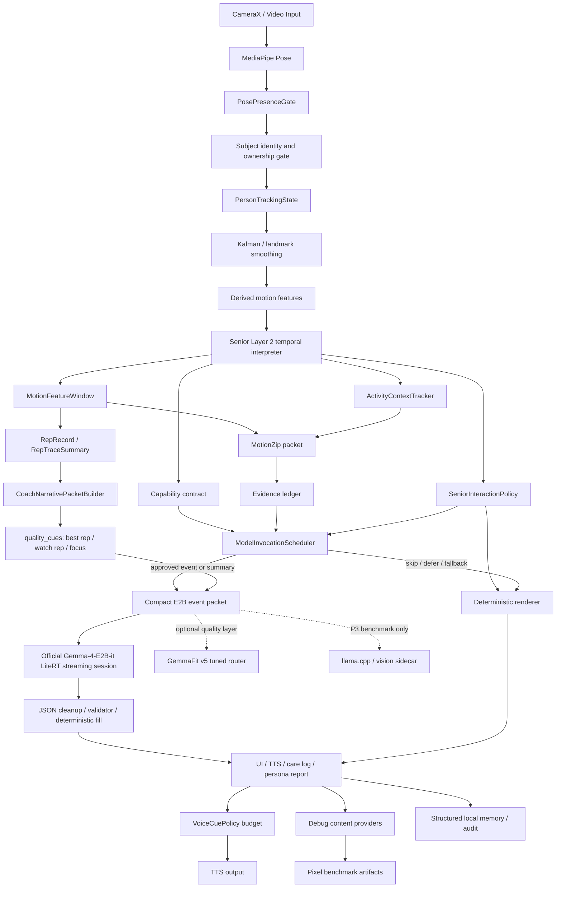

# GemmaFit Project Architecture and Technical Highlights

## Purpose

GemmaFit is a local-first movement-quality coaching app for the Kaggle Gemma 4
Impact Challenge. The current product story is dual-mode:

- **Senior Strength Mode** is the hero demo: older-adult friendly home activity
  support, care logs, subjective check-ins, dual-task prompts, and caregiver
  reports.
- **General Fitness Mode** remains the shared biomechanics foundation for
  multi-exercise motion analysis.

The technical position is:

```text
Single-camera pose evidence
-> deterministic gates
-> compact auditable event packets
-> bounded local Gemma function routing / reporting
```

GemmaFit is not a medical assessment system. It does not diagnose, predict fall
risk, detect sarcopenia, prescribe rehabilitation, estimate force, estimate GRF,
estimate EMG, infer true muscle activation, or claim clinical improvement.

## High-Level Architecture



The most important design split is ownership:

| Layer | Owner | What it decides | What it must not decide |
| --- | --- | --- | --- |
| Pose and tracking | MediaPipe + Kotlin gates | Person presence, selected subject, renderability, hard-judgment eligibility | Medical or coaching claims |
| Motion tools | Kotlin / C++ deterministic code | Angles, ROM proxies, tempo, stability proxies, confidence, event windows | Force, GRF, EMG, ligament strain |
| Layer 2 | Kotlin FSM first | Senior activity phase, event, judgeability, abstain reason | Final user-facing report or tool call |
| MotionZip | Kotlin packet builder | What temporal evidence is preserved under token budget | New movement conclusions |
| Scheduler | Kotlin runtime | Whether to call E2B now, defer, skip, or fallback | Function name, args, evidence refs |
| SeniorInteractionPolicy | Kotlin deterministic policy | Repeat cue, pause for setup/support, continue, end summary based on observable support states | Cognitive diagnosis, dementia score, wandering risk |
| E2B router | Official Gemma-4-E2B-it LiteRT baseline | Schema-shaped report wording and bounded refusal wording over listed evidence | Override gates or invent evidence |
| Optional tuned router | GemmaFit v5 / 270M research | Improve schema fidelity, wording, or latency if proven | Replace the official P0 baseline without evidence |
| Validator | Kotlin policy | Accept/reject model output, enforce refs and forbidden claims | Rewrite deterministic facts |

## Current P0 Runtime Baseline

As of 2026-05-17, the deadline architecture is:

```text
Live path:
CameraX / Video
-> MediaPipe Pose
-> presence, subject, confidence, and judgeability gates
-> derived motion features
-> Senior Layer 2 FSM + ActivityContextTracker
-> SeniorInteractionPolicy
-> deterministic UI / TTS

Model path:
event or session trigger
-> MotionFeatureWindow
-> MotionZip compact evidence
-> CoachNarrativePacket quality cues
-> ModelInvocationScheduler
-> official Gemma-4-E2B-it LiteRT-LM
-> streaming JSON / schema-shaped output
-> Android parser, validator, deterministic fill, fallback
-> summary, care log, evidence explanation, export
```

Important runtime decisions:

- The live frame loop does **not** call E2B.
- Async live vision is allowed only as a low-frequency sidecar after
  deterministic output has already rendered, currently for optional
  `WARNING_PERSISTED` explanation context. `SETUP_CHECK` is deterministic-only
  in v1.
- Video mode improves output quality through compact `quality_cues`, not by
  sending raw video or asking Gemma to reinterpret every frame.
- TTS is rate-limited by `VoiceCuePolicy`: same-cue/category cooldowns,
  global cooldowns, rolling spoken budgets, and a small speech queue prevent
  live coaching from becoming too dense.
- Official `Gemma-4-E2B-it` LiteRT-LM is the P0 baseline.
- GemmaFit v5 is an optional quality layer, not a deadline dependency.
- `llama.cpp` vision / GGUF sidecar is P3 benchmark-only because Pixel memory
  pressure is too high for the main flow.
- MotionZip is task-preserving temporal evidence compression, not lossless
  video compression.
- Constrained output is enforced primarily by the app-owned JSON/parser,
  validator, evidence-ref whitelist, forbidden-claim rejection, deterministic
  fill, and fallback. The latest official E2B smoke did not observe native
  LiteRT tool-call objects.

## Validation Snapshot

The 2026-05-17 local validation run updated the architecture evidence from
"planned reports" to concrete demo-proof artifacts:

| Contract | Status | Evidence |
| --- | --- | --- |
| Live safety stays deterministic | `PASS` | `docs/benchmark/live_safety_contract_report_2026-05-16/report.md` proves `LIVE_FRAME` skips Gemma and multimodal backend, even with multimodal flags enabled. |
| Person recovery / abstain | `PASS_WITH_GAP` | `docs/benchmark/person_recovery_yolo_fallback_report_2026-05-16/report.md` covers no-person, occlusion, low visibility, and predicted tracking; fresh multi-person replay is still a gap. |
| LiteRT local summary | `PASS_WITH_CAVEAT` | `docs/benchmark/litert_runtime_stability_report_2026-05-16/report.md` covers readiness, prewarm, prompt inference, and the 100-run anchor; a single current constrained run still reported `constrained_decoding=false`. |
| Memory / export boundary | `PASS_WITH_RUNTIME_STATE_GAP` | `docs/benchmark/memory_export_boundary_report_2026-05-16/report.md` covers unit policy and raw-output scans; one real caregiver export runtime payload still needs capture. |
| Senior Layer 2 replay | `PASS_WITH_VIDEO_SCOPE_NOTE` | `docs/benchmark/senior_layer2_video_replay_report_2026-05-16/report.md` covers Layer 2 smoke and chair/balance replay clips. |

These reports support the demo claim that GemmaFit separates deterministic
safety evidence from Local Gemma explanation and summary. They do not support
claims about clinical risk, force/load, EMG, heart-rate status, raw-video
memory, or frame-by-frame Gemma vision.

## Runtime Pipeline

### 1. Person And Pose Evidence

GemmaFit treats "a person is visible" and "this is the selected workout
subject" as separate decisions.

```text
MediaPipe pose landmarks
-> PosePresenceGate
-> SubjectIdentityMatcher / SubjectMotionTracker
-> PoseOwnershipGate
-> PersonTrackingState
```

Current policy:

- MediaPipe is the primary phone path.
- YOLO is a future or optional low-frequency burst fallback for reacquisition,
  not an always-on mobile detector.
- Kalman smoothing is allowed for ROI continuity, but predicted-only frames
  cannot support hard coaching.
- If tracking is `lost`, `hold`, `predicted`, or multi-person ambiguous, the app
  should not draw a wrong selected-subject skeleton and should not emit hard
  movement judgments.

Key technical value:

- Reduces wrong-person feedback in multi-person videos.
- Keeps overlay integrity tied to judgeability.
- Makes "no skeleton" an explicit safety state instead of a silent bug.

### 2. Derived Motion Features

The app does not send raw video or raw full skeleton streams to the language
model. It first computes compact motion evidence:

- rep window duration
- knee / hip / trunk angle extrema
- velocity and tempo proxies
- confidence floor
- stabilization proxy
- visibility and subject state
- event and phase evidence refs

Example:

```json
{
  "window_ms": 3200,
  "hip_vertical_displacement": 0.13,
  "knee_angle_min": 78,
  "knee_angle_max": 166,
  "rep_duration_ms": 3200,
  "velocity_peak": "low",
  "stabilization_ms": 800,
  "confidence_floor": 0.82
}
```

These are proxies derived from single-camera pose. They are not physical force,
joint moment, GRF, EMG, heart rate, or clinical measurements.

### 3. Layer 2 Temporal Interpreter

Layer 2 converts frame-level derived features into temporal evidence.

P0 implementation direction:

- deterministic FSM for senior-safe activities
- event-triggered, not per-frame model calls
- explicit `judgeable`, `monitor_only`, and `abstain`

Priority senior activities:

| Activity | Supported evidence | Boundaries |
| --- | --- | --- |
| `chair_sit_to_stand` | rep count, phases, tempo, standing stabilization | No fall-risk or sarcopenia claim |
| `supported_squat` | controlled depth proxy, trunk proxy, support state | Support can make frontal knee rules not applicable |
| `balance_hold` | hold duration and sway proxy | No clinical balance score |
| `step_touch` | cadence and step completion proxy | No gait disorder classification |

Sport or complex movements such as lunge or basketball jump shot are useful for
false-positive reduction, but they should remain monitor-only or non-senior
until the product path needs them.

### 4. MotionZip Temporal Evidence Compression

MotionZip compresses time series before E2B sees them. It is an app-side packet
format, not a change to Gemma architecture.

It preserves:

- recent motion detail
- event boundaries
- confidence floors
- angle extrema
- velocity peaks
- subject-tracking state
- low-confidence spans
- unsupported-claim boundaries
- evidence refs

It discards:

- redundant per-frame detail
- raw video
- raw full skeleton stream
- image crops and ReID embeddings

This protects both performance and safety: the model receives enough temporal
context to write useful summaries, but not enough unbounded raw data to invent
unsupported judgments.

### 4.1 Video Summary Quality Pass

Video analysis has more time than live coaching, so it uses the extra budget to
make the evidence packet more useful rather than calling Gemma on every frame.

The session-summary path now adds a compact narrative layer:

```text
RepRecord + RepTraceSummary
-> CoachNarrativePacketBuilder
-> rep_summaries + session_trend + baseline_comparison
-> quality_cues
-> compact E2B session-summary prompt
```

`quality_cues` is intentionally small. It carries:

- `best`: the strongest visible rep and its evidence ref
- `watch`: the rep most worth watching, when one exists
- `focus`: one deterministic next-focus label such as `controlled_tempo`,
  `upright_trunk_control`, or `repeat_best_rep_pattern`

The model may use these cues to choose one concrete observation and one next
focus. It may not turn them into new safety claims, clinical statements, force
estimates, fall-risk statements, or raw-video interpretations. The Android
validator still checks JSON shape, evidence refs, forbidden claims, and
deterministic fill.

### 5. ModelInvocationScheduler

The scheduler decides if a local model call is worth making.

Default policy:

| Situation | Decision |
| --- | --- |
| Normal live frames | Skip model call |
| Low confidence / subject lost / predicted only | Skip or deterministic fallback |
| Clean rep completed | Defer to session summary |
| High-confidence event needing explanation | Optional E2B call |
| Session ended | E2B summary/report call |
| Caregiver export | E2B persona report call |
| Medical or force question | Deterministic refusal or E2B refusal tool |

The scheduler never chooses final function names or function arguments. That is
the E2B router's job, and the Android validator still has final authority.

## Local Model Role

GemmaFit currently treats the local model as a bounded evidence router and
report writer.

The P0 runtime baseline is the official Google AI Edge Gallery
`Gemma-4-E2B-it` LiteRT-LM artifact. It is used with a strict prompt/schema
contract, Android-side JSON cleanup, schema validation, evidence-ref validation,
deterministic fill, and deterministic fallback. GemmaFit v5 fine-tuning is now
an optional quality layer rather than a prerequisite for the deadline demo.

Current Pixel evidence for the official E2B baseline is recorded across the
5/15 and 5/16 benchmark artifacts:

| Check | Result |
| --- | --- |
| Official E2B model size | `2,538,766,336` bytes |
| GPU prewarm | about `9.7s` in the first Edge Gallery smoke |
| 100-run official JSON gate | `100 / 100` endpoint success, generation success, and model JSON parse success |
| 100-run latency | generate avg `24.9s`, p50 `24.8s`, p95 `26.5s`; wall p95 `45.2s` because some runs reinitialized the engine |
| Streaming warm first token | `0.96s` to `3.14s` after generation start on a reused engine |
| Streaming full generation | about `22.5s` to `25.2s` for the tested prompt |
| MotionZip equivalence key checks | `8 / 8` dense-vs-compressed key facts passed |
| Native LiteRT tool calls | `0 / 100` observed in the constrained official smoke |
| Vision sidecar | Async sidecar only for optional warning explanation / low-frequency evidence questions; not setup, not live verdicting. Pixel GGUF vision remains P3 benchmark-only. |
| Live camera image path | RGBA/YUV audit uses `CAMERAX_ROTATED_YUV_BITMAP`; accepted-frame p95 about `10.2ms` in the latest mobile audit |

Interpretation:

- The official model is good enough for P0 schema-shaped summaries when the
  app owns validation and fallback.
- Streaming solves perceived first-response latency only after prewarm; it does
  not make full generation instantaneous.
- The constrained-decoding spike did not prove native tool-call enforcement on
  the official artifact, so product safety must not depend on native tool calls.
- MotionZip evidence is validated for preserving the tested activity, state,
  event, velocity, confidence, and low-confidence reason facts. It is not a
  claim that every video detail is preserved.

The official prompt contract and optional v5 fine-tune path are evaluated for:

- evidence-to-function routing
- evidence-ref citation
- refusal on unsupported questions
- care-log wording
- multi-persona report wording
- zh-TW wrapper behavior
- hard cases such as missing refs, tracking uncertainty, and schema fuzz

They do not learn:

- raw video understanding
- raw skeleton classification
- frame-by-frame biomechanics
- force / GRF / EMG estimation
- medical diagnosis
- fall-risk scoring
- sarcopenia detection

### E2B vs 270M Decision

Current default:

- **Official Gemma-4-E2B-it LiteRT** is the P0 evidence router and report
  writer baseline.
- **GemmaFit v5** is optional for better schema fidelity, evidence citation,
  refusal stability, zh-TW wording, and shorter prompts after it passes concrete
  Pixel gates.
- **FunctionGemma 270M** is optional and only useful if E2B function JSON,
  latency, or refusal stability fails on device.

If 270M is added later, the split should be:

```text
270M: fast function routing
E2B: richer summary and persona wording
```

Until the official E2B path fails a concrete gate, a second model is not
required. The stronger product claim is that the app-owned evidence contract,
not fine-tuning, preserves the key movement facts for local Gemma output.

## Senior Hero Features

### Care Log

Input:

- session summary
- Evidence Card
- capability contract
- evidence ledger
- memory trend slice
- optional subjective check-in

Output sections:

- What was completed
- Observed movement quality
- What was not judged
- Next session focus
- Caregiver note

The care log must include non-diagnostic boundaries.

### Subjective Check-In

After activity, the app asks bounded questions:

- RPE 0-10
- breathlessness: none / mild / moderate / strong
- leg soreness: none / mild / moderate / strong
- needed rest: yes / no
- discomfort reported: yes / no

These become self-report evidence nodes:

- `subjective.rpe`
- `subjective.breathlessness`
- `subjective.leg_soreness`
- `subjective.needed_rest`
- `subjective.discomfort_reported`

Self-report evidence is not camera evidence. It cannot become a diagnosis.

### Multi-Persona Reports

The same evidence can be rendered for:

- `senior`: short, encouraging, large-text friendly
- `caregiver`: completion, observed events, self-report, support focus
- `professional_share`: structured home activity summary with explicit
  non-clinical boundary

The report may change tone, but it may not change facts.

### Dual-Task Training

Dual-task prompts combine a cognitive prompt with a low-impact movement target.

Supported response paths:

- gesture: left hand = A, right hand = B, clap = confirm, two-hand raise = skip
- voice: bounded A/B, yes/no, 1-4, short options

Voice answer is deliberately a closed input channel:

```text
Android SpeechRecognizer
-> SeniorVoiceAnswerParser
-> DualTaskAttempt
-> Evidence ledger
```

It cannot overwrite pose evidence. A voice answer can set
`answer_matched=true`, but it does not prove `movement_completed=true`. Movement
completion stays owned by pose or gesture evidence.

Noise control:

- ASR is started only after user taps `Voice answer`.
- Repeat/TTS is disabled while ASR is listening.
- Only current prompt answer options are accepted.
- Out-of-set speech is converted to fallback, not sent to LLM.
- Medical/free-form speech does not become a dual-task answer.

## Trust, Audit, And Debug Layer

GemmaFit exposes trust state directly in UI and debug outputs.

User-facing badges:

- `Pose rules`
- `Local Gemma`
- `Template fallback`
- `Abstained`

Debug content providers include:

- model readiness
- LiteRT smoke
- Layer 2 smoke
- model invocation smoke
- care log
- dual task
- subjective check-in
- persona report
- MotionZip packet

Important debug fields:

- backend
- model file / selected model
- function name
- fallback reason
- evidence refs
- unsupported judgments
- quality flags
- person tracking state
- scheduler decision
- stream phase
- first-token time
- constrained-decoding flag
- native tool-call observed flag
- thermal status
- per-stage timings

This makes demo failures explainable: model missing, model loaded but template
failed, fallback rendered, or deterministic gates abstained.

## Memory Policy

GemmaFit memory is structured and app-owned.

Allowed memory:

- session summaries
- calibration baselines
- bounded preferences
- accepted care logs
- dual-task results
- evidence-ledger references

Blocked memory:

- raw video by default
- raw full skeleton streams
- free-form model memory
- medical labels
- force / GRF / EMG claims
- fall-risk or sarcopenia scores

Every accepted or rejected memory write should be auditable.

## Current Technical Highlights

1. **Evidence-first model use**
   - The model sees compact evidence, not raw video.
   - Deterministic gates own what can and cannot be judged.

2. **Subject ownership before pose judgment**
   - Wrong-person tracking is treated as a safety risk.
   - Hard coaching is blocked when identity or pose is uncertain.

3. **Temporal interpretation without per-frame LLM**
   - Layer 2 and MotionZip preserve motion context without calling E2B every
     frame.

4. **Bounded local Gemma routing**
   - Official E2B emits schema-shaped JSON over listed evidence.
   - Android validation enforces function shape, evidence refs, forbidden-claim
     policy, deterministic fill, and fallback.

5. **Senior-safe product scope**
   - The hero demo is practical: sit-to-stand, check-in, care log, dual-task,
     caregiver report.
   - It avoids unsupported clinical claims.

6. **Noise-resistant voice input**
   - Voice answer is closed-set only.
   - ASR cannot pollute motion judgment or free-form LLM context.

7. **Demo trust layer**
   - Readiness, source badges, fallback reasons, and "why not judged" explain
     what happened without hiding uncertainty.

8. **Local-first privacy**
   - No account required for coaching.
   - No raw video upload is required.
   - Memory stores structured evidence, not raw recordings.

9. **Prewarmed streaming model UX**
   - `Session.generateContentStream` lets the UI show model progress before the
     full summary is complete.
   - Prewarm is required for the first-token target because cold engine
     initialization dominates perceived latency.

## Current Readiness Snapshot

As of the current implementation direction:

| Area | Status | Notes |
| --- | --- | --- |
| Senior Hero UI route | Implemented | Demo flow can render senior home, live cue, dual-task, check-in, care log, persona report. |
| Dual-task ASR | Implemented behind bounded parser | User must grant microphone permission on device. Gesture remains primary fallback. |
| Model readiness UI | Implemented | Shows local Gemma, fallback, or missing model state. |
| Official E2B LiteRT baseline | P0 default | Edge Gallery `Gemma-4-E2B-it` initializes on GPU, generates schema-shaped output, passes the 100-run official JSON gate, and passes MotionZip key-fact equivalence. |
| Async streaming UI | Implemented / needs demo polish | Reused official E2B engine produced first token in `0.96s` to `3.14s`; cold runs still need prewarm. |
| Constrained decoding | Smoke-safe but not native-tool proven | 100-run constrained endpoint had no parse failures or hangs, but observed `0 / 100` native LiteRT tool calls; app validator remains the real enforcement layer. |
| GemmaFit v5 tuning | Optional quality layer | No longer a P0 dependency; use only if it improves schema fidelity, wording, or latency after Pixel gates. |
| Layer 2 FSM | Updated / integration continues | Senior P0 deterministic contract and recorder path are documented; ActivityContextTracker handles ambiguous activity context without hard labels. |
| MotionZip | Benchmark proof + product packet path | Equivalence harness passes `8 / 8`; product runtime should use compressed-only prompts. |
| SeniorInteractionPolicy | P0 design and partial integration | Observable support states drive deterministic repeat/pause/end decisions without cognitive or medical inference. |
| RGBA / camera image path | Audited | Latest mobile audit shows `CAMERAX_ROTATED_YUV_BITMAP`, `YUV_420_888` input, and accepted-frame p95 around `10.2ms`. |
| YOLO/ReID fallback | Designed/prototype | Not the primary mobile path; use only low-frequency recovery. |
| Vision sidecar | P3 benchmark-only | Pixel GGUF vision tests showed large memory pressure; not part of the demo main path. |

## Source Documents

- Main plan: `implementation_plan.md`
- Realtime person/tracking and official E2B runtime plan:
  `docs/design/realtime_person_detection_and_finetune_plan.md`
- Senior Layer 2 contract:
  `docs/design/layer2_senior_activity_model.md`
- Model invocation scheduler:
  `docs/design/model_invocation_scheduler.md`
- MotionZip compression:
  `docs/design/motionzip_v4_temporal_evidence_compression.md`
- Official E2B + MotionZip runtime:
  `docs/design/official_e2b_motionzip_runtime_architecture.md`
- Current draw.io architecture:
  `docs/design/gemmafit_current_architecture.drawio`

Current benchmark evidence:

- Official constrained 100-run JSON gate:
  `docs/benchmark/litert_prompt_smoke_constrained_100_official_2026-05-16/summary.json`
- Official streaming warm first-token check:
  `docs/benchmark/litert_prompt_stream_dev_2_warm_official_2026-05-16/summary.json`
- MotionZip dense-vs-compressed equivalence:
  `docs/benchmark/motionzip_equivalence_prompt_endpoint_hardened4_official_2026-05-16/summary.json`
- Live camera RGBA/YUV path audit:
  `docs/benchmark/rgba_pipeline_mobile_default_optimized_2026-05-16/summary.json`
