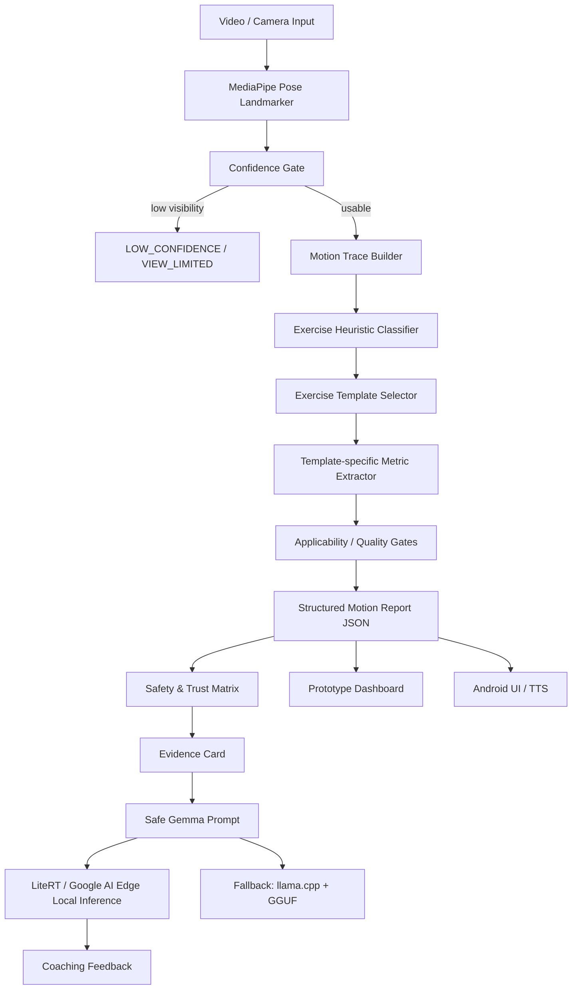

# GemmaFit: Trustworthy Multi-Exercise Motion Feedback

GemmaFit is a Kaggle Gemma 4 Impact Challenge project for a local-first, explainable movement feedback system. It combines pose-derived motion evidence, deterministic quality gates, and Gemma-generated coaching feedback. The system improves access to exercise feedback while explicitly refusing unsupported judgments.

Core claims:

```text
Trustworthy motion feedback that knows its limits.
A local movement coach that remembers training evidence, not medical assumptions.
```

Core pipeline:

```text
Pose -> Motion Trace -> Exercise Template -> Structured Metrics
-> Trust Matrix -> Evidence Card -> Safe Gemma Feedback
```

GemmaFit is not a universal posture judge. It only judges when evidence supports the conclusion, marks unsupported rules as not applicable, and keeps every output inside movement-quality language rather than medical diagnosis.

## 1. Competition Positioning

| Track | Positioning |
| --- | --- |
| Main Track | Dual-mode local movement feedback. Senior Strength Mode is the hero demo for older adults at risk of strength decline; General Fitness Mode is the broader multi-exercise foundation. |
| Safety & Trust | Primary impact category. Every verdict includes evidence, confidence, applicability gates, unsupported-judgment boundaries, memory write rules, and refusal-on-medical-question handling. |
| Health & Sciences | Sarcopenia-aware strength-maintenance support. Framed as pose-based movement quality feedback, not sarcopenia detection, fall-risk scoring, or treatment. |
| Digital Equity & Inclusion | Offline, voice-first, large-text UI for older adults. No cloud dependency, no account required. |
| LiteRT / Google AI Edge | Preferred special technology path for local Android inference and official Google AI Edge alignment. |
| llama.cpp | Fallback local inference path using existing GGUF models if LiteRT / AI Edge integration is not ready. |
| Unsloth | Optional P2 path only if fine-tune benchmark evidence is produced. |

## 2. Product Boundaries

### In Scope for MVP

- Squat, push-up, and lunge templates with exercise-specific movement-quality metrics.
- Deadlift as a bonus template for hip hinge, trunk angle, and bar/body path proxy.
- Skeleton overlay, 2D motion trajectories, tempo, rep counting, and session summaries.
- Context-aware quality gates: `OK`, `VIEW_LIMITED`, `LOW_CONFIDENCE`, `NOT_APPLICABLE`, `MONITOR`, `WARNING`, `CRITICAL`.
- Evidence Card output for every warning or critical verdict.
- Safe Gemma feedback generated only from structured evidence.

### Out of Scope for MVP

- Medical diagnosis.
- Clinical injury prediction.
- Sarcopenia detection or treatment.
- Fall-risk prediction or scoring.
- Rehabilitation prescription.
- Muscle mass estimate.
- Clinical improvement claim.
- Precise joint force, lumbar loading, or inverse dynamics.
- EMG-style muscle activation percentages.
- Full all-exercise error detection.
- Multi-view 3D reconstruction.
- Storing raw video by default. (Memory layer holds structured records only.)

Preferred wording:

```text
movement quality feedback
pose-based estimate
single-camera proxy
camera-limited observation
training cue
uncertainty boundary
```

Avoid:

```text
medical-grade diagnosis
precise joint force
injury prediction
clinical risk
muscle activation percentage
```

Literature and claim policy:

- Canonical literature source: `docs/papers/literature_review.md`.
- Chinese working review: `docs/papers/literature_review_zh.md`.
- Product claims must stay inside non-diagnostic movement-quality coaching.
- Evidence provenance, selective abstention, pose-metric calibration, motor
  learning feedback, and bounded function calling support the architecture.
- Benchmarks can support schema compliance, refusal behavior, evidence-ref
  validity, and local inference status. They do not validate clinical
  biomechanics thresholds.
- Product UI should show judged evidence first and skipped judgments second;
  refusal is a capability boundary, not the main coaching message when useful
  evidence exists.

## 3. System Architecture



### Data Flow

```text
MediaPipe landmarks
-> confidence filtering
-> joint angles + 2D trajectories
-> heuristic exercise scoring
-> exercise-specific metric template
-> applicability gates
-> trust matrix status
-> evidence card JSON
-> safe Gemma prompt
-> local feedback via LiteRT / AI Edge or llama.cpp fallback
-> dashboard / Android UI / TTS
```

### Realtime Evidence and E2B Fine-tune Policy

Realtime analysis follows a tools-first policy:

```text
CameraX -> MediaPipe Pose -> Kalman ROI / landmark smoothing
-> optional YOLO burst fallback -> Motion Feature Window
-> Capability Contract -> E2B function-call router
```

YOLO is a recovery/fallback path for subject loss, multi-person ambiguity, or
ROI drift; it is not the always-on mobile path. Deterministic tools compute
person tracking state, pose confidence, angles, velocity proxies, rep windows,
and capability boundaries before any model call. E2B receives compact event
packets and may explain or route one function call, but it may not override
deterministic gates or invent force, GRF, EMG, heart-rate, fall-risk, clinical,
or raw-video judgments.

Detailed implementation and fine-tune spec:
`docs/design/realtime_person_detection_and_finetune_plan.md`.

## 4. MVP Exercise Templates

Each exercise uses a small, high-confidence metric set. Rules are not shared globally without applicability checks.

General Fitness Mode templates:

| Exercise | Metrics | Unsupported / limited judgments |
| --- | --- | --- |
| `squat` | depth, knee angle, hip angle, trunk lean, tempo, COM monitor | Knee valgus only from frontal or near-frontal view; no joint force estimate. |
| `push_up` | elbow angle, body line, hip sag, depth proxy, tempo | Knee valgus and COM/BoS are not high-confidence push-up metrics. |
| `lunge` | front knee angle, step length proxy, trunk uprightness, stability, tempo | Single-frame bilateral asymmetry is not critical because the motion is unilateral. |
| `deadlift` | hip hinge, trunk angle, bar/body path proxy, tempo | No lumbar force, disc loading, or injury-risk prediction. |

Senior Strength Mode templates:

| Exercise | Metrics | Unsupported / limited judgments |
| --- | --- | --- |
| `chair_sit_to_stand` | rep count, tempo, trunk control proxy, knee/hip ROM proxy, low-confidence count | No sarcopenia diagnosis, fall-risk, or rehab prescription. |
| `supported_squat` | depth proxy, support contact, trunk lean, tempo | `knee_valgus_fppa` is `NOT_APPLICABLE` when wall/chair support obstructs frontal view. |
| `balance_hold` | stability proxy (COM excursion within BoS), hold duration, sway frequency | No vestibular assessment, no clinical balance score. |
| `step_touch` (optional) | cadence, step length proxy, trunk uprightness | No gait disorder classification. |

Senior Mode templates always populate the Evidence Card's
`unsupported_judgments` list with at least: `sarcopenia_diagnosis`,
`fall_risk_prediction`, `rehabilitation_prescription`,
`muscle_mass_estimate`, `clinical_improvement_claim` — even when
the metric itself is healthy.

Example template:

```json
{
  "exercise": "deadlift",
  "metrics": [
    "hip_hinge",
    "trunk_angle",
    "bar_or_body_path_proxy",
    "tempo"
  ],
  "unsupported_judgments": [
    "lumbar_force",
    "disc_loading",
    "clinical_injury_risk"
  ]
}
```

## 5. Heuristic Exercise Detection

MVP uses heuristic scoring, not a trained classifier.

Inputs:

- body orientation: horizontal vs upright
- primary moving joint: knee, hip, elbow, shoulder
- support type: bipedal, unilateral, floor support
- short-window angle range
- wrist / ankle / hip relative positions
- landmark visibility

Output:

```json
{
  "exercise": "squat",
  "exercise_confidence": 0.84,
  "candidate_scores": {
    "squat": 0.84,
    "push_up": 0.10,
    "lunge": 0.42,
    "deadlift": 0.55
  },
  "basis": [
    "upright_body",
    "large_knee_rom",
    "bipedal_support"
  ]
}
```

If the top score is low or candidates are too close:

```json
{
  "exercise": "unknown_or_mixed",
  "exercise_confidence": 0.41,
  "status": "VIEW_LIMITED"
}
```

## 6. Safety & Trust Matrix

The original 8 safety rules remain as biomechanical building blocks, but every rule must pass applicability, confidence, and evidence checks before emitting feedback.

| Status | Trigger | App display | Gemma can say | Gemma must not say |
| --- | --- | --- | --- | --- |
| `OK` | Confidence and view are usable; no active issue. | Normal movement-quality cue. | "Your trunk angle stayed stable." | Medical or injury diagnosis. |
| `VIEW_LIMITED` | Camera angle, crop, or occlusion makes a metric invalid. | Ask user to adjust camera or view. | "This angle is not suitable for judging knee valgus." | Any FPPA or unsupported risk verdict. |
| `LOW_CONFIDENCE` | Pose confidence is low or landmarks jump. | Observation mode; no risk grade. | "Tracking is unstable; please re-record." | Warning, critical, or clinical claim. |
| `NOT_APPLICABLE` | Rule does not apply to the exercise or view. | Show unsupported rule as skipped. | "This rule does not apply to the current movement." | Hard-apply squat rules to push-up or lunge. |
| `MONITOR` | Proxy metric is observable but not strong enough. | Trend/watch cue. | "Monitor this path if it repeats." | Force, load, or injury claim. |
| `WARNING` | Reliable evidence crosses a prototype threshold. | Clear coaching cue. | "Slow down and reset your trunk position." | Diagnosis or exact injury risk. |
| `CRITICAL` | Multiple reliable signals or severe threshold breach. | Stop/reset cue. | "Stop this rep and reset with better control." | "You are injured" or clinical language. |

Gate behavior:

| Gate | Old rule | MVP behavior |
| --- | --- | --- |
| Knee alignment / FPPA | Rule 1 | Only frontal or near-frontal lower-body views. Otherwise `NOT_APPLICABLE` or `VIEW_LIMITED`. |
| Trunk / spine angle | Rule 2 | Exercise-specific. Squat and deadlift use different interpretation. Push-up uses body-line instead. |
| Joint overextension | Rule 3 | Conservative monitor unless confidence and temporal persistence are high. |
| Bilateral asymmetry | Rule 4 | Only single-frame active for bilateral templates. Lunge/unilateral phases do not become critical from one frame. |
| COM / BoS | Rule 5 | Static or slow controlled movement only. Dynamic movement is `MONITOR`, not critical. |
| Rapid movement | Rule 6 | `600 deg/s`; requires smoothing and consecutive-frame confirmation. |
| ROM insufficient | Rule 7 | Only active when the exercise template defines target ROM. |
| Neck / head position | Rule 8 | Gated by visibility; low confidence becomes monitor or view-limited. |

## 7. Structured Motion Report and Evidence Card

The prototype dashboard, Android UI, and Gemma prompt should share the same report shape.

Structured report:

```json
{
  "frame": 184,
  "exercise": "squat",
  "exercise_confidence": 0.86,
  "phase": "descent",
  "rep": 4,
  "metrics": {
    "trunk_lean_deg": 38.2,
    "knee_angle_deg": 74.2,
    "tempo_dps": 420.0
  },
  "quality_flags": [
    {
      "id": "trunk_forward_lean",
      "status": "WARNING",
      "value": 38.2,
      "threshold": 35.0,
      "evidence": "pose_based_template_metric"
    }
  ],
  "not_applicable": [
    {
      "id": "knee_valgus_fppa",
      "reason": "side_view_not_frontal_lower_body"
    }
  ],
  "capability_contract": {
    "can_judge": [
      {
        "metric": "squat_depth",
        "confidence_ceiling": 0.9,
        "evidence_refs": ["metric.squat.depth"]
      },
      {
        "metric": "trunk_lean",
        "confidence_ceiling": 0.85,
        "evidence_refs": ["metric.squat.trunk_lean"]
      }
    ],
    "cannot_judge": [
      {
        "metric": "frontal_knee_valgus",
        "reason": "side_view",
        "required_evidence": ["frontal_view", "hip_knee_ankle_visible"],
        "evidence_refs": ["metric.squat.fppa_deg"]
      },
      {
        "metric": "joint_force",
        "reason": "single_camera_proxy",
        "required_evidence": ["force_plate_or_inverse_dynamics"]
      }
    ]
  },
  "evidence_dag": {
    "version": "evidence_dag_v1",
    "nodes": [
      {
        "id": "metric.squat.depth",
        "type": "template_metric",
        "metric": "depth",
        "value": 0.82,
        "confidence": 0.85,
        "source_module": "motion_quality",
        "source_function": "extract_template_metrics"
      },
      {
        "id": "capability.cannot.frontal_knee_valgus",
        "type": "capability",
        "metric": "frontal_knee_valgus",
        "status": "NOT_APPLICABLE"
      }
    ],
    "edges": [
      {
        "from": "capability.cannot.frontal_knee_valgus",
        "to": "metric.squat.fppa_deg",
        "relation": "blocks"
      }
    ]
  },
  "notes": [
    "not_medical_diagnosis",
    "single_camera_pose_based_feedback"
  ]
}
```

Evidence Card:

```json
{
  "exercise": "squat",
  "view": "side",
  "verdict": "WARNING",
  "reason": "trunk_forward_lean_increased",
  "evidence": {
    "trunk_angle_deg": 38.2,
    "hip_vertical_displacement": 0.42,
    "pose_confidence": 0.87
  },
  "trust_flags": [
    "SIDE_VIEW_OK",
    "KNEE_VALGUS_NOT_APPLICABLE",
    "COM_BOS_MONITOR_ONLY"
  ],
  "unsupported_judgments": [
    "joint_force",
    "clinical_injury_risk"
  ],
  "model_boundary": "Movement quality feedback only, not medical diagnosis."
}
```

Requirement: every `WARNING` or `CRITICAL` verdict must include explainable evidence. Unsupported judgments must be shown explicitly instead of hidden.

Capability Contract requirement: before Gemma is called, the app must declare
which metrics are currently judgeable and which are not. `VIEW_LIMITED` and
`NOT_APPLICABLE` block only the affected metric, not the entire workout. For
example, a side-view squat can still judge depth, tempo, and trunk lean while
blocking frontal knee valgus. Gemma may cite only `evidence_refs` that exist in
the Evidence DAG, and the app falls back to deterministic coaching if the model
selects a tool for a `cannot_judge` metric.

## 8. Gemma Role and Safe Prompt

Gemma is not the vision model and not the rule engine. Gemma is the summary-only local evidence router and explanation layer. **Gemma never decides state changes.** The app's policy engine owns all writes, exports, recalibration decisions, capability gates, and fallback behavior.

Gemma responsibilities:

- convert evidence cards into short coaching feedback
- explain uncertainty and view limitations
- summarize session trends from memory slices the app provides
- choose one supported function call from `can_judge` metrics only
- cite Evidence DAG ids in `evidence_refs`
- support multilingual feedback
- refuse unsupported medical, force, injury, sarcopenia, or fall-risk claims

Gemma boundaries (the policy engine, not Gemma, decides):

- whether a `MemoryUpdateRequest` is written
- whether a calibration baseline is replaced
- whether a caregiver export is produced
- whether a session is finalized

Function-calling vocabulary used by Gemma:

| Function | Direction | Purpose |
| --- | --- | --- |
| Coaching FCs (v1: 9 functions) | model -> app | per-frame coaching cue |
| `read_memory(scope, exercise?)` | model -> app -> model | request a closed-set memory slice |
| `request_memory_update(...)` | model -> app | proposes a memory write; app validates |
| `summarize_trend(scope)` | model -> app | read-only prose summary for the user |
| `refuse_unsupported_question(reason)` | model -> app | safe refusal path for medical / fall-risk / sarcopenia questions |

Safe prompt constraints:

```text
You are a movement feedback assistant.
Only use the provided evidence.
Do not infer medical diagnosis.
Do not estimate joint force or injury risk.
If evidence is insufficient, say the judgment is not applicable.
Use concise coaching language.
```

Prototype behavior:

- Dashboard can use deterministic `mock_gemma_feedback`.
- Next local-model path is LiteRT / Google AI Edge.
- If LiteRT / AI Edge is not ready, use `llama.cpp + GGUF` as fallback.
- All outputs must identify their source, for example `mock_gemma_feedback`, `litert_local_gemma`, or `llama_cpp_fallback`.

## 9. Prototype Dashboard and Android Target

Prototype dashboard MVP:

- auto-detected exercise and confidence
- skeleton overlay
- joint angle and trajectory charts
- active quality feedback
- trust matrix status
- evidence card
- unsupported judgments
- mock or local Gemma message
- structured JSON export

Android target:

- CameraX + MediaPipe pose feed
- native `motion_report` through JNI
- Trust Matrix UI
- Evidence Card UI
- unsupported judgments panel
- safe local Gemma feedback
- TTS with cooldown

## 10. Existing Completed Work

Preserve the completed phases:

- `compute_angles.py`: FPPA, Rule 6 `600 deg/s`, 36 tests pass.
- `smooth_angle.py`: Savitzky-Golay angular velocity smoothing.
- `rep_counter.py`: rep counter state machine.
- `movement_classifier_prototype.py`: physical movement pattern prototype.
- `com_tracker_prototype.py`: De Leva segment COM and BoS convex hull.
- `muscle_focus_prototype.py`: pose-based muscle focus estimate.
- `test_phase1_showcase.py`: 202/202 PASS.
- `test_8rules.py`: 67 PASS.
- Native C++: `ctest` 4/4 pass, including `test_motion_quality`.
- Zenodo full benchmark: Rule 2 Bad Back precision high but recall low; Bad Heel proxy F1 approximately 0.787.
- Phase 3 dashboard: exercise templates, gates, mock feedback, and structured report export complete.
- Android Phase 4 partial: native `motion_quality` report, Trust Matrix UI, Evidence Card UI, and quality flag UI are wired; debug APK builds, installs, and launches.

## 11. Android / Native Long-term Path

Current route:

```text
Prototype Dashboard complete
-> Android motion_report partial integration complete
-> Native motion_quality algorithm module complete
-> Trust Matrix UI complete
-> Evidence Card JSON and UI complete
-> Safe Gemma prompt
-> LiteRT / Google AI Edge feasibility spike
-> local Gemma feedback
-> llama.cpp + GGUF fallback if needed
-> demo video and writeup
```

Native modules should evolve from `SafetyReport[]` only toward:

```text
MovementPattern
ExerciseTemplate
StructuredMotionReport
QualityGateResult[]
EvidenceCard
MuscleFocusEstimate
```

## 11.5 Dual-Mode Product: Senior Strength + General Fitness

GemmaFit ships in two modes. **General Fitness Mode** preserves the
existing multi-exercise foundation (squat, push-up, lunge, deadlift).
**Senior Strength Mode** is the hero demo: safe, offline home movement
coaching for older adults at risk of strength decline.

The two modes share the pose pipeline, kinematics modules, and Evidence
Card schema. They diverge in:

- exercise template set (see §4)
- default UI scale, voice speed, and cue style (see §11.7)
- mandatory `unsupported_judgments` payload on every Evidence Card

## 11.6 Evidence-Bounded Long-Term Memory

```text
GemmaFit uses evidence-triggered local memory: critical events are
saved immediately, caregiver exports are human-readable but
non-clinical, and calibration updates are proposed only from
repeated high-confidence clean reps.
```

Trust boundary:

- Gemma summarizes; the app's policy engine decides what is written,
  exported, or used to recalibrate.
- Gemma may emit `request_memory_update` and `read_memory(scope)` via
  function calling, but the app applies refusal regex, evidence
  thresholds, and idempotency checks before any state change.
- Raw video is never stored by default. Only structured records are
  persisted.

### Storage layers

Single-device, single-user. No multi-tenant key.

| Layer | Contents | Backend | Why |
| --- | --- | --- | --- |
| Hot config | `UserProfileMemory`, `CalibrationMemory` | Android DataStore (Proto) | small, frequent reads at startup |
| Append-only log | `SessionSummary`, `EvidenceMemoryEntry` | SQLite (Room, WAL mode) | by-date / by-exercise aggregation |
| Audit | every memory write/reject decision | JSONL `audit.log` | tamper-evident, exportable, 90-day retention |

Filesystem layout:

```text
/data/data/com.gemmafit/files/memory/
  profile.pb
  calibration/<exercise>.pb
  sessions.db
  audit.log
exports/                  (caregiver exports, user-initiated only)
```

### Schemas

```text
UserProfileMemory:
  language               (e.g. zh-TW, en)
  voice_speed            (0.7 .. 1.3)
  font_scale             (1.0, 1.5, 2.0)
  assisted_mode          (Senior Mode toggle)
  cue_preference         (ENCOURAGING | TERSE | DETAILED)
  schema_version

CalibrationMemory:
  exercise
  baseline_rom_proxy     (nullable until first calibration)
  baseline_tempo_sec
  camera_setup_hint      (distance, angle, lighting hint)
  support_type           (CHAIR | WALL | NONE)
  captured_at
  sessions_since_calibration
  clean_reps_collected   (used by adaptive recalibration)
  low_confidence_streak

SessionSummary:
  session_id, date, mode (SENIOR | GENERAL)
  exercise, reps, duration_sec
  warnings_count, low_confidence_count, not_applicable_count
  trend_notes            (closed enum: tempo_slowing, rom_stable, ...)
  evidence_card_ids      (FK into evidence log)

EvidenceMemoryEntry:
  evidence_card_id, session_id
  exercise, status (OK | WARNING | NOT_APPLICABLE | LOW_CONFIDENCE)
  metric_id, value, confidence
  unsupported_judgments  (always populated for Senior Mode)
  created_at

MemoryUpdateRequest:
  request_id (idempotency key)
  type (PROFILE | CALIBRATION | TREND_NOTE)
  proposed_value (structured payload, not freeform text)
  evidence_ids (>= 1 required for TREND_NOTE)
  confidence
  app_validation_status (PENDING | ACCEPTED | REJECTED | NEEDS_REVIEW)

CaregiverSummary:
  period_start, period_end
  sessions_completed
  common_camera_limitations
  common_cues
  unsupported_judgments_acknowledged (mandatory)
  no_medical_diagnosis (sentinel = true)
```

### Read protocol (tool round-trip)

Gemma never sees memory unless it asks. The single FC function:

```json
{ "function": "read_memory",
  "args": { "scope": "TRENDS_7D", "exercise": "chair_sit_to_stand" } }
```

Closed scope set:

| Scope | Returns | Approx tokens |
| --- | ---: | ---: |
| `PROFILE` | UserProfileMemory | ~50 |
| `CALIBRATION` | CalibrationMemory for exercise | ~80 |
| `TRENDS_7D` | aggregated SessionSummary, last 7 days | ~110 (compact JSON) |
| `TRENDS_30D` | aggregated SessionSummary, last 30 days | ~200 |
| `EVIDENCE_FOR_SESSION` | EvidenceMemoryEntry list for one session | caregiver flow only |

Raw `EvidenceMemoryEntry` rows are **never** sent into a coaching
prompt. They feed the Evidence Card UI and the caregiver export, not
model context.

Latency mitigations on Pixel 8 Pro:

- pre-warm cache when an exercise starts (`PROFILE` + current
  `CALIBRATION` + `TRENDS_7D` resident in memory before first frame)
- llama.cpp KV cache reuse across the round-trip
- compact JSON keys for memory return values

Expected memory round-trip cost: **0.4 - 0.7 s**, not 1 - 2 s.

### Write policy (event-driven)

Session writes are event-driven, not fixed-cadence:

| Event | Action |
| --- | --- |
| Rep completed | append rep metrics to in-memory buffer |
| Quality flag is `WARNING` or `CRITICAL` | flush buffer immediately |
| Every 5 reps OR every 60 seconds | checkpoint to SQLite (whichever first) |
| App backgrounded / paused | flush |
| Session ended (user stop or auto-end) | flush + finalize SessionSummary |
| `MemoryUpdateRequest` accepted | flush so the request and stored state agree |

`MemoryWritePolicy` validates every `MemoryUpdateRequest`:

```text
1. Schema validation (proto)
2. Provenance: TREND_NOTE requires >= 1 evidence_id
3. Refusal regex against avoid-words from CLAUDE.md
4. Confidence floor (TREND_NOTE: confidence >= 0.6)
5. Idempotency (request_id seen before -> no-op)
6. Audit (accept and reject both write to audit.log)
```

A rejected update never crashes the LLM call. The next prompt informs
Gemma that the request was rejected with the policy reason so it does
not retry identically.

### Adaptive recalibration

The fixed `N=10 sessions` cadence is only a fallback. The primary
trigger is evidence quality, not elapsed sessions:

- Collect `OK` / `MONITOR` reps with high landmark visibility and no
  warnings into `clean_reps_collected`.
- Propose a new baseline candidate only when:
  - `clean_reps_collected >= 30`
  - reps span at least 3 distinct sessions
- If the candidate baseline differs from the stored baseline by more
  than 15 percent, do NOT auto-overwrite; surface a confirmation
  prompt.
- If `camera_setup_hint` changes (different distance / angle), force
  recalibration on the next session.
- If `low_confidence_streak >= 2`, do not update the baseline; instead
  prompt the user to adjust the camera.

### Caregiver export

Two artifacts per export, both opt-in and user-initiated:

- `caregiver_export_v1.json` (machine-readable canonical form)
- in-app human-readable summary, shareable as `.txt` or `.html`

Summary tone is care, not clinic. It includes:

- sessions completed this week
- which movements completed consistently
- most common training cues
- count of camera-limited or low-confidence interruptions
- mandatory disclaimer block (sarcopenia, fall risk, diagnosis)

PDF export is deferred; users can use Android system print/share for
a one-off PDF if needed.

## 11.7 Senior Mode UI

Four screens, designed for older-adult accessibility:

| Screen | Primary purpose | Accessibility requirements |
| --- | --- | --- |
| Senior Home | start a session | Three large buttons (Sit-to-Stand, Supported Squat, Balance Hold), voice-first controls, `font_scale` 2.0 default, high contrast |
| Live Coach | per-rep guidance | camera preview, skeleton overlay, current cue text, Trust Matrix badge, large stop/reset button, TTS cooldown >= 3 s |
| Evidence Card | explainability | what was observed, why feedback was given, what was NOT judged (always populated for Senior Mode) |
| Memory & Trends | session history | weekly sessions, completion count, common cues, low-confidence interruptions, clear-memory and export controls |

Cross-cutting requirements:

- Every screen exposes a one-tap stop / reset action.
- Every screen with feedback shows the source label
  (`mock_gemma_feedback`, `litert_local_gemma`, or
  `llama_cpp_fallback`).
- Memory & Trends always shows clear-memory and export controls; the
  export confirmation reminds the user that the report is non-clinical.

Figma note: this section defines behavior, states, accessibility, and
the data shown per screen. Concrete Figma node implementation is
deferred until a Figma URL or selected node is available.

## 11.8 Senior Hero v4: Care Log + Dual-task

Senior Hero Mode is the primary demo storyline for v4. The product remains a
non-diagnostic movement-quality coach, but the user-facing value shifts from
"AI form critique" toward offline home activity support for older adults:

```text
Senior movement evidence
-> Capability Contract
-> Evidence Ledger
-> care activity log / dual-task prompt / bounded summary
```

General Fitness Mode remains the shared biomechanics foundation. Senior Hero
adds two bounded workflows:

| Workflow | Output | Boundary |
| --- | --- | --- |
| Care Log | A caregiver-readable activity log with completion, visible movement quality, skipped judgments, next-session focus, and caregiver note. | No fall-risk score, sarcopenia detection, rehab prescription, clinical improvement claim, muscle mass estimate, force, EMG, or injury prediction. |
| Dual-task | A low-impact cognitive-plus-movement prompt using gesture-first and voice-optional answers. | No cognitive diagnosis, dementia screening, clinical interpretation, fast turns, high-impact jumping, or unsupported rehab tasks. |

### Care Log Contract

Care logs are generated from `CareLogContext`, not raw video:

```json
{
  "schema_version": "care_log_v1",
  "activity": "chair_sit_to_stand",
  "duration_sec": 180,
  "completed_reps": 12,
  "stability_events": 2,
  "capability_contract": {},
  "evidence_refs": ["metric.senior.reps", "metric.senior.stability_events"],
  "unsupported_judgments": [
    "fall_risk_prediction",
    "sarcopenia_detection",
    "rehabilitation_prescription",
    "muscle_mass_estimate",
    "clinical_improvement_claim"
  ]
}
```

The rendered log always follows:

```text
What was completed
Observed movement quality
What was not judged
Next session focus
Caregiver note
```

If local model output is missing, cites invalid evidence, or uses unsupported
language, the deterministic renderer produces a safe `create_care_activity_log`
fallback.

### Dual-task Contract

Dual-task items are selected from bounded, low-impact activities:

- Primary response mode: gesture.
- Secondary response mode: voice.
- Gesture meanings: left hand = A, right hand = B, clap = confirm, two-hand
  raise = skip/cancel.
- Voice parser accepts only bounded answer sets such as A/B, yes/no, 1-4, or
  short options. Low ASR confidence falls back to gesture.

Supported cognitive targets are memory recall, category sorting, attention
switching, simple arithmetic, and orientation. The app records whether the
bounded answer matched and whether the expected movement was completed, but it
does **not** judge cognition or dementia risk.

### v4 FunctionGemma Fine-tune Target

v4 fine-tuning targets a small FunctionGemma evidence router:

```text
activity_context + motion_context + capability_contract + evidence_ledger
-> one function call
```

Target base model: `google/functiongemma-270m-it`.

Target artifact:

```text
models/gemmafit-v4-senior-router.litertlm
```

The model learns tool selection and evidence citation only. It does not learn
biomechanics thresholds, medical labels, raw video, raw landmarks, force, EMG,
fall risk, sarcopenia, or rehab progress.

New v4 tools:

| Function | Role |
| --- | --- |
| `create_care_activity_log` | Generate the bounded caregiver activity log. |
| `select_dual_task_prompt` | Select a supported low-impact dual-task prompt. |
| `record_dual_task_result` | Record bounded attempt outcome without cognitive diagnosis. |

### v4.1 Subjective Check-in and Persona Reports

v4.1 does **not** ask the camera or model to estimate true momentum, force,
GRF, heart rate, or medical risk. Instead, the app combines objective movement
evidence with bounded self-report:

```text
objective pose summary evidence
+ subjective check-in evidence
-> persona-specific activity report
```

Post-session check-in uses large buttons, bounded voice, or caregiver-assisted
input:

```json
{
  "schema_version": "subjective_checkin_v1",
  "rpe_0_10": 4,
  "breathlessness": "mild",
  "leg_soreness": "mild",
  "needed_rest": false,
  "discomfort_reported": false,
  "evidence_refs": [
    "subjective.rpe",
    "subjective.breathlessness",
    "subjective.leg_soreness",
    "subjective.needed_rest",
    "subjective.discomfort_reported"
  ]
}
```

Subjective evidence nodes use `type=self_report` and `source=user_checkin`.
They can contextualize a report, but they are never converted into heart-rate,
diagnosis, injury, fall-risk, sarcopenia, or rehabilitation-progress claims.
If a user reports strong breathlessness, discomfort, dizziness, chest
tightness, pain, or needing rest, the app gives a stop/rest/caregiver/professional
help boundary without diagnosing the cause.

Persona reports are generated by `create_persona_activity_report`:

| Persona | Output tone | Boundary |
| --- | --- | --- |
| `senior` | Short, encouraging, large-text friendly. | No clinical or sensor claims. |
| `caregiver` | Completion, visible stability proxy, self-report, next support focus. | No fall-risk or rehab interpretation. |
| `professional_share` | Structured activity summary for sharing with a clinician. | Explicitly non-clinical and no heart-rate/force/status claim. |

Additional v4.1 tools:

| Function | Role |
| --- | --- |
| `ask_subjective_checkin` | Ask bounded post-session exertion questions. |
| `record_subjective_checkin` | Record RPE, breathlessness, soreness, rest, and discomfort as self-report evidence. |
| `create_persona_activity_report` | Generate `senior`, `caregiver`, or `professional_share` report text from objective + subjective evidence. |

Debug endpoints:

```text
content://com.gemmafit.debug/care_log
content://com.gemmafit.debug/dual_task
content://com.gemmafit.debug/subjective_checkin
content://com.gemmafit.debug/persona_report
```

## 12. Safety and Trust Requirements

The system must:

- gate all feedback by landmark confidence
- mark unsupported views and unsupported exercises clearly
- show unsupported judgments in the UI
- avoid medical diagnosis language
- avoid exact force, EMG, muscle activation, or injury-risk claims
- avoid sarcopenia detection, fall-risk scoring, or rehab prescription claims
- separate `prototype_threshold` from literature-backed or locally calibrated thresholds
- state when a metric is a single-camera proxy
- avoid critical warnings when a rule is not applicable to the exercise context
- preserve a refusal path when evidence is insufficient
- never store raw video by default
- never write a `TREND_NOTE` memory entry without at least one evidence id
- require ≥ 30 clean reps across ≥ 3 sessions before proposing a calibration baseline update
- force recalibration when `camera_setup_hint` changes
- skip baseline updates when `low_confidence_streak >= 2`; prompt the user to adjust the camera instead
- always include the unsupported-judgment disclaimer block in caregiver exports
- ensure memory writes go through `MemoryWritePolicy`, not directly from Gemma output

Required disclaimer:

```text
This is pose-based movement quality feedback, not a medical diagnosis.
Single-camera estimates may be limited by view angle, lighting, clothing, and occlusion.
```

## 13. Sprint Plan

| Phase | Focus | Status |
| --- | --- | --- |
| Phase 0 | Environment and assets | Complete |
| Phase 1 | Python biomechanics prototypes | Complete |
| Phase 2 | Native C++ core prototypes | Complete |
| Phase 3 | Multi-exercise Prototype Dashboard | Complete |
| Phase 4 | Android integration | Partial complete / in progress |
| Phase 5 | Demo video, writeup, media gallery | Pending |

Phase 4 next:

- Trust Matrix UI.
- Evidence Card JSON and UI.
- Unsupported judgments display.
- Safe Gemma prompt template.
- LiteRT / Google AI Edge feasibility spike.
- llama.cpp fallback only if AI Edge is not ready.

Phase 5 demo theme:

```text
Correct judgment + correct refusal.
```
