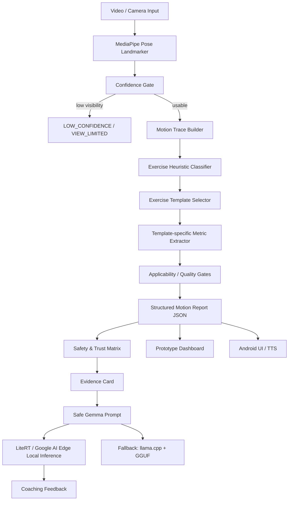

# GemmaFit: Trustworthy Multi-Exercise Motion Feedback

GemmaFit is a Kaggle Gemma 4 Impact Challenge project for a local-first, explainable movement feedback system. It combines pose-derived motion evidence, deterministic quality gates, and Gemma-generated coaching feedback. The system improves access to exercise feedback while explicitly refusing unsupported judgments.

Core claim:

```text
Trustworthy motion feedback that knows its limits.
```

Core pipeline:

```text
Pose -> Motion Trace -> Exercise Template -> Structured Metrics
-> Trust Matrix -> Evidence Card -> Safe Gemma Feedback
```

GemmaFit is not a universal posture judge. It only judges when evidence supports the conclusion, marks unsupported rules as not applicable, and keeps every output inside movement-quality language rather than medical diagnosis.

## 1. Competition Positioning

| Track | Positioning |
| --- | --- |
| Main Track | Multi-exercise motion understanding, local-first app workflow, explainable coaching, and real-world access to movement feedback. |
| Safety & Trust | Primary impact category. Every verdict includes evidence, confidence, applicability gates, and unsupported-judgment boundaries. |
| Health & Sciences | Secondary relevance only. Framed as pose-based movement quality feedback, not medical diagnosis or force estimation. |
| LiteRT / Google AI Edge | Preferred special technology path for local Android inference and official Google AI Edge alignment. |
| llama.cpp | Fallback local inference path using existing GGUF models if LiteRT / AI Edge integration is not ready. |
| Unsloth | Optional P2 path only if fine-tune benchmark evidence is produced. |

## 2. Product Boundaries

### In Scope for MVP

- Squat, push-up, and lunge templates with exercise-specific movement-quality metrics.
- Deadlift as a bonus template for hip hinge, trunk angle, and bar/body path proxy.
- Skeleton overlay, 2D motion trajectories, tempo, rep counting, and session summaries.
- Context-aware quality gates: `OK`, `VIEW_LIMITED`, `LOW_CONFIDENCE`, `NOT_APPLICABLE`, `MONITOR`, `WARNING`, `CRITICAL`.
- Evidence Card output for every warning or critical verdict.
- Safe Gemma feedback generated only from structured evidence.

### Out of Scope for MVP

- Medical diagnosis.
- Clinical injury prediction.
- Precise joint force, lumbar loading, or inverse dynamics.
- EMG-style muscle activation percentages.
- Full all-exercise error detection.
- Multi-view 3D reconstruction.

Preferred wording:

```text
movement quality feedback
pose-based estimate
single-camera proxy
camera-limited observation
training cue
uncertainty boundary
```

Avoid:

```text
medical-grade diagnosis
precise joint force
injury prediction
clinical risk
muscle activation percentage
```

## 3. System Architecture



### Data Flow

```text
MediaPipe landmarks
-> confidence filtering
-> joint angles + 2D trajectories
-> heuristic exercise scoring
-> exercise-specific metric template
-> applicability gates
-> trust matrix status
-> evidence card JSON
-> safe Gemma prompt
-> local feedback via LiteRT / AI Edge or llama.cpp fallback
-> dashboard / Android UI / TTS
```

## 4. MVP Exercise Templates

Each exercise uses a small, high-confidence metric set. Rules are not shared globally without applicability checks.

| Exercise | Metrics | Unsupported / limited judgments |
| --- | --- | --- |
| `squat` | depth, knee angle, hip angle, trunk lean, tempo, COM monitor | Knee valgus only from frontal or near-frontal view; no joint force estimate. |
| `push_up` | elbow angle, body line, hip sag, depth proxy, tempo | Knee valgus and COM/BoS are not high-confidence push-up metrics. |
| `lunge` | front knee angle, step length proxy, trunk uprightness, stability, tempo | Single-frame bilateral asymmetry is not critical because the motion is unilateral. |
| `deadlift` | hip hinge, trunk angle, bar/body path proxy, tempo | No lumbar force, disc loading, or injury-risk prediction. |

Example template:

```json
{
  "exercise": "deadlift",
  "metrics": [
    "hip_hinge",
    "trunk_angle",
    "bar_or_body_path_proxy",
    "tempo"
  ],
  "unsupported_judgments": [
    "lumbar_force",
    "disc_loading",
    "clinical_injury_risk"
  ]
}
```

## 5. Heuristic Exercise Detection

MVP uses heuristic scoring, not a trained classifier.

Inputs:

- body orientation: horizontal vs upright
- primary moving joint: knee, hip, elbow, shoulder
- support type: bipedal, unilateral, floor support
- short-window angle range
- wrist / ankle / hip relative positions
- landmark visibility

Output:

```json
{
  "exercise": "squat",
  "exercise_confidence": 0.84,
  "candidate_scores": {
    "squat": 0.84,
    "push_up": 0.10,
    "lunge": 0.42,
    "deadlift": 0.55
  },
  "basis": [
    "upright_body",
    "large_knee_rom",
    "bipedal_support"
  ]
}
```

If the top score is low or candidates are too close:

```json
{
  "exercise": "unknown_or_mixed",
  "exercise_confidence": 0.41,
  "status": "VIEW_LIMITED"
}
```

## 6. Safety & Trust Matrix

The original 8 safety rules remain as biomechanical building blocks, but every rule must pass applicability, confidence, and evidence checks before emitting feedback.

| Status | Trigger | App display | Gemma can say | Gemma must not say |
| --- | --- | --- | --- | --- |
| `OK` | Confidence and view are usable; no active issue. | Normal movement-quality cue. | "Your trunk angle stayed stable." | Medical or injury diagnosis. |
| `VIEW_LIMITED` | Camera angle, crop, or occlusion makes a metric invalid. | Ask user to adjust camera or view. | "This angle is not suitable for judging knee valgus." | Any FPPA or unsupported risk verdict. |
| `LOW_CONFIDENCE` | Pose confidence is low or landmarks jump. | Observation mode; no risk grade. | "Tracking is unstable; please re-record." | Warning, critical, or clinical claim. |
| `NOT_APPLICABLE` | Rule does not apply to the exercise or view. | Show unsupported rule as skipped. | "This rule does not apply to the current movement." | Hard-apply squat rules to push-up or lunge. |
| `MONITOR` | Proxy metric is observable but not strong enough. | Trend/watch cue. | "Monitor this path if it repeats." | Force, load, or injury claim. |
| `WARNING` | Reliable evidence crosses a prototype threshold. | Clear coaching cue. | "Slow down and reset your trunk position." | Diagnosis or exact injury risk. |
| `CRITICAL` | Multiple reliable signals or severe threshold breach. | Stop/reset cue. | "Stop this rep and reset with better control." | "You are injured" or clinical language. |

Gate behavior:

| Gate | Old rule | MVP behavior |
| --- | --- | --- |
| Knee alignment / FPPA | Rule 1 | Only frontal or near-frontal lower-body views. Otherwise `NOT_APPLICABLE` or `VIEW_LIMITED`. |
| Trunk / spine angle | Rule 2 | Exercise-specific. Squat and deadlift use different interpretation. Push-up uses body-line instead. |
| Joint overextension | Rule 3 | Conservative monitor unless confidence and temporal persistence are high. |
| Bilateral asymmetry | Rule 4 | Only single-frame active for bilateral templates. Lunge/unilateral phases do not become critical from one frame. |
| COM / BoS | Rule 5 | Static or slow controlled movement only. Dynamic movement is `MONITOR`, not critical. |
| Rapid movement | Rule 6 | `600 deg/s`; requires smoothing and consecutive-frame confirmation. |
| ROM insufficient | Rule 7 | Only active when the exercise template defines target ROM. |
| Neck / head position | Rule 8 | Gated by visibility; low confidence becomes monitor or view-limited. |

## 7. Structured Motion Report and Evidence Card

The prototype dashboard, Android UI, and Gemma prompt should share the same report shape.

Structured report:

```json
{
  "frame": 184,
  "exercise": "squat",
  "exercise_confidence": 0.86,
  "phase": "descent",
  "rep": 4,
  "metrics": {
    "trunk_lean_deg": 38.2,
    "knee_angle_deg": 74.2,
    "tempo_dps": 420.0
  },
  "quality_flags": [
    {
      "id": "trunk_forward_lean",
      "status": "WARNING",
      "value": 38.2,
      "threshold": 35.0,
      "evidence": "pose_based_template_metric"
    }
  ],
  "not_applicable": [
    {
      "id": "knee_valgus_fppa",
      "reason": "side_view_not_frontal_lower_body"
    }
  ],
  "notes": [
    "not_medical_diagnosis",
    "single_camera_pose_based_feedback"
  ]
}
```

Evidence Card:

```json
{
  "exercise": "squat",
  "view": "side",
  "verdict": "WARNING",
  "reason": "trunk_forward_lean_increased",
  "evidence": {
    "trunk_angle_deg": 38.2,
    "hip_vertical_displacement": 0.42,
    "pose_confidence": 0.87
  },
  "trust_flags": [
    "SIDE_VIEW_OK",
    "KNEE_VALGUS_NOT_APPLICABLE",
    "COM_BOS_MONITOR_ONLY"
  ],
  "unsupported_judgments": [
    "joint_force",
    "clinical_injury_risk"
  ],
  "model_boundary": "Movement quality feedback only, not medical diagnosis."
}
```

Requirement: every `WARNING` or `CRITICAL` verdict must include explainable evidence. Unsupported judgments must be shown explicitly instead of hidden.

## 8. Gemma Role and Safe Prompt

Gemma is not the vision model and not the rule engine. Gemma is the local explanation and coaching layer.

Gemma responsibilities:

- convert evidence cards into short coaching feedback
- explain uncertainty and view limitations
- summarize session trends
- support multilingual feedback
- refuse unsupported medical, force, or injury claims

Safe prompt constraints:

```text
You are a movement feedback assistant.
Only use the provided evidence.
Do not infer medical diagnosis.
Do not estimate joint force or injury risk.
If evidence is insufficient, say the judgment is not applicable.
Use concise coaching language.
```

Prototype behavior:

- Dashboard can use deterministic `mock_gemma_feedback`.
- Next local-model path is LiteRT / Google AI Edge.
- If LiteRT / AI Edge is not ready, use `llama.cpp + GGUF` as fallback.
- All outputs must identify their source, for example `mock_gemma_feedback`, `litert_local_gemma`, or `llama_cpp_fallback`.

## 9. Prototype Dashboard and Android Target

Prototype dashboard MVP:

- auto-detected exercise and confidence
- skeleton overlay
- joint angle and trajectory charts
- active quality feedback
- trust matrix status
- evidence card
- unsupported judgments
- mock or local Gemma message
- structured JSON export

Android target:

- CameraX + MediaPipe pose feed
- native `motion_report` through JNI
- Trust Matrix UI
- Evidence Card UI
- unsupported judgments panel
- safe local Gemma feedback
- TTS with cooldown

## 10. Existing Completed Work

Preserve the completed phases:

- `compute_angles.py`: FPPA, Rule 6 `600 deg/s`, 36 tests pass.
- `smooth_angle.py`: Savitzky-Golay angular velocity smoothing.
- `rep_counter.py`: rep counter state machine.
- `movement_classifier_prototype.py`: physical movement pattern prototype.
- `com_tracker_prototype.py`: De Leva segment COM and BoS convex hull.
- `muscle_focus_prototype.py`: pose-based muscle focus estimate.
- `test_phase1_showcase.py`: 202/202 PASS.
- `test_8rules.py`: 67 PASS.
- Native C++: `ctest` 4/4 pass, including `test_motion_quality`.
- Zenodo full benchmark: Rule 2 Bad Back precision high but recall low; Bad Heel proxy F1 approximately 0.787.
- Phase 3 dashboard: exercise templates, gates, mock feedback, and structured report export complete.
- Android Phase 4 partial: native `motion_quality` report, Trust Matrix UI, Evidence Card UI, and quality flag UI are wired; debug APK builds, installs, and launches.

## 11. Android / Native Long-term Path

Current route:

```text
Prototype Dashboard complete
-> Android motion_report partial integration complete
-> Native motion_quality algorithm module complete
-> Trust Matrix UI complete
-> Evidence Card JSON and UI complete
-> Safe Gemma prompt
-> LiteRT / Google AI Edge feasibility spike
-> local Gemma feedback
-> llama.cpp + GGUF fallback if needed
-> demo video and writeup
```

Native modules should evolve from `SafetyReport[]` only toward:

```text
MovementPattern
ExerciseTemplate
StructuredMotionReport
QualityGateResult[]
EvidenceCard
MuscleFocusEstimate
```

## 12. Safety and Trust Requirements

The system must:

- gate all feedback by landmark confidence
- mark unsupported views and unsupported exercises clearly
- show unsupported judgments in the UI
- avoid medical diagnosis language
- avoid exact force, EMG, muscle activation, or injury-risk claims
- separate `prototype_threshold` from validated thresholds
- state when a metric is a single-camera proxy
- avoid critical warnings when a rule is not applicable to the exercise context
- preserve a refusal path when evidence is insufficient

Required disclaimer:

```text
This is pose-based movement quality feedback, not a medical diagnosis.
Single-camera estimates may be limited by view angle, lighting, clothing, and occlusion.
```

## 13. Sprint Plan

| Phase | Focus | Status |
| --- | --- | --- |
| Phase 0 | Environment and assets | Complete |
| Phase 1 | Python biomechanics prototypes | Complete |
| Phase 2 | Native C++ core prototypes | Complete |
| Phase 3 | Multi-exercise Prototype Dashboard | Complete |
| Phase 4 | Android integration | Partial complete / in progress |
| Phase 5 | Demo video, writeup, media gallery | Pending |

Phase 4 next:

- Trust Matrix UI.
- Evidence Card JSON and UI.
- Unsupported judgments display.
- Safe Gemma prompt template.
- LiteRT / Google AI Edge feasibility spike.
- llama.cpp fallback only if AI Edge is not ready.

Phase 5 demo theme:

```text
Correct judgment + correct refusal.
```
